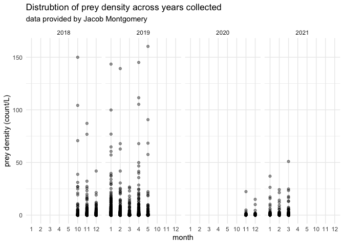
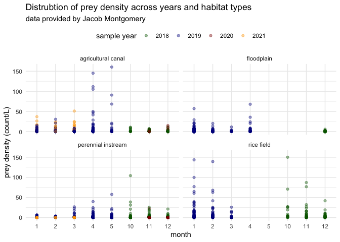
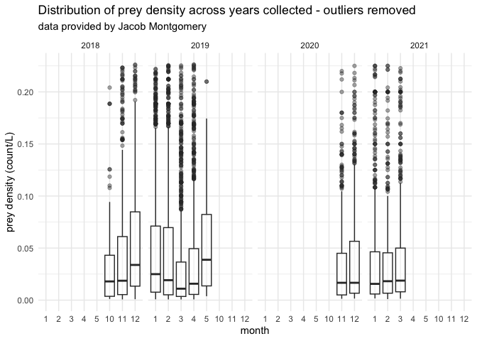
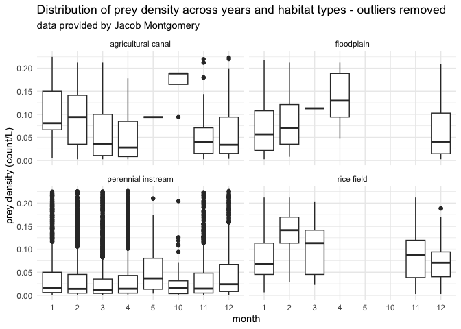

Jacob Montgomery Data
================
Maddee Rubenson (FlowWest)
2023-01-11

## Montgomery Data Standardization

**Datasets provided:**

- [Fish Food on Floodplain Farm Fields 2019 and
  2021](https://portal.edirepository.org/nis/mapbrowse?packageid=edi.996.2)

**Author contact info:**

Jacob Montgomery \[[jacob@caltrout.org](jacob@caltrout.org)\]

### Prey Data

Final prey density dataset includes the following variables:

- `date`: YYYY-MM-DD
- `gear_type`: the type of gear used to collect zooplankton.
- `species`: species of zooplankton
- `life_stage`: lifestage of zooplankton species
- `prey_density`: density of zooplankton (count/L)
- `size_class`: size class of zooplankton, determined by mesh size
- `mesh_size`: mesh size of net used to collect zooplankton
- `habitat_type`: habitat type of location where zooplankton were
  collected
- `lat`: latitude of sampling location
- `lon`: longitude of sampling location
- `site`: location description
- `author`: author of dataset

#### Raw data

``` r
# this a script that sources the EDI data
source('data-raw//montgomery/food_4_fish_data_access.R')

montgomery_prey_data |> glimpse()
```

    ## Rows: 822
    ## Columns: 72
    ## $ id                         <chr> "RRCAN_11/16/2020_8:50", "RRCAN_11/23/2020_…
    ## $ pseudodiptomus_adult       <dbl> 20.000000, 0.000000, 0.000000, 0.000000, 0.…
    ## $ psedodiptomus_copepidite   <dbl> 220.000000, 0.000000, 0.000000, 0.000000, 0…
    ## $ acanthocyclops_adult       <dbl> 0.000000, 7.692308, 0.000000, 0.000000, 0.0…
    ## $ acanthocyclops_copepididte <dbl> 180.00000, 92.30769, 1166.66667, 1650.00000…
    ## $ cyclopoid_sp               <dbl> 0, 0, 0, 0, 0, 0, 0, 0, 0, 0, 0, 0, 0, 0, 0…
    ## $ cyclopoid_nauplii          <dbl> 0.000000, 0.000000, 400.000000, 25.000000, …
    ## $ calanoid_naulpii           <dbl> 20.00000, 84.61538, 100.00000, 25.00000, 50…
    ## $ harpaticoid                <dbl> 0.00000, 0.00000, 66.66667, 0.00000, 183.33…
    ## $ daphnia_pulex              <dbl> 60.00000, 0.00000, 0.00000, 0.00000, 16.666…
    ## $ daphnia_laevis             <dbl> 0, 0, 0, 0, 0, 0, 0, 0, 0, 0, 0, 0, 0, 0, 0…
    ## $ daphnia_magna              <dbl> 0, 0, 0, 0, 0, 0, 0, 0, 0, 0, 0, 200, 300, …
    ## $ daphnia_mendotea           <dbl> 0, 0, 0, 0, 0, 0, 0, 0, 0, 0, 0, 0, 0, 0, 0…
    ## $ ceriodaphnia_sp            <dbl> 0.00000, 0.00000, 16.66667, 50.00000, 0.000…
    ## $ simocephalus_sp            <dbl> 0.000000, 0.000000, 0.000000, 0.000000, 0.0…
    ## $ bosmina_sp                 <dbl> 4860.00000, 930.76923, 666.66667, 875.00000…
    ## $ sididae                    <dbl> 20.00000, 0.00000, 0.00000, 0.00000, 0.0000…
    ## $ chydorus_sphaericus        <dbl> 40.00000, 100.00000, 316.66667, 87.50000, 2…
    ## $ eurycercus                 <dbl> 0, 0, 0, 0, 0, 0, 0, 0, 0, 0, 0, 0, 0, 0, 0…
    ## $ alona                      <dbl> 0.00000, 15.38462, 33.33333, 12.50000, 16.6…
    ## $ chydoridae                 <dbl> 0, 0, 0, 0, 0, 0, 0, 0, 0, 0, 0, 0, 0, 0, 0…
    ## $ diaphanosoma               <dbl> 180.000000, 0.000000, 0.000000, 0.000000, 0…
    ## $ scapholeberis              <dbl> 0.000000, 0.000000, 0.000000, 0.000000, 0.0…
    ## $ cladocera_embryo           <dbl> 0.00000, 0.00000, 0.00000, 0.00000, 0.00000…
    ## $ eucypris                   <dbl> 40.00000, 30.76923, 16.66667, 0.00000, 16.6…
    ## $ ilyocypris                 <dbl> 0.000000, 0.000000, 0.000000, 0.000000, 0.0…
    ## $ cypridopsis                <dbl> 0.00000, 15.38462, 0.00000, 0.00000, 0.0000…
    ## $ gammarus                   <dbl> 0, 0, 0, 0, 0, 0, 0, 0, 0, 0, 0, 0, 0, 0, 0…
    ## $ rotifer                    <dbl> 3240.00000, 492.30769, 1583.33333, 1525.000…
    ## $ polychaete                 <dbl> 0.000000, 0.000000, 0.000000, 0.000000, 0.0…
    ## $ acari                      <dbl> 0.000000, 0.000000, 0.000000, 0.000000, 0.0…
    ## $ chironomid_larvae          <dbl> 0.000000, 0.000000, 0.000000, 0.000000, 0.0…
    ## $ oligochaete                <dbl> 0.000000, 7.692308, 0.000000, 0.000000, 50.…
    ## $ gastropod                  <dbl> 0, 0, 0, 0, 0, 0, 0, 0, 0, 0, 0, 0, 0, 0, 0…
    ## $ tardigrade                 <dbl> 0.000000, 0.000000, 0.000000, 0.000000, 0.0…
    ## $ nematode                   <dbl> 0.00000, 0.00000, 0.00000, 0.00000, 0.00000…
    ## $ hyalella                   <dbl> 0, 0, 0, 0, 0, 0, 0, 0, 0, 0, 0, 0, 0, 0, 0…
    ## $ hydra                      <dbl> 0.000000, 0.000000, 0.000000, 0.000000, 0.0…
    ## $ terrestrial_insect         <dbl> 0.0, 0.0, 0.0, 0.0, 0.0, 0.0, 0.0, 0.0, 0.0…
    ## $ collembola                 <dbl> 0.000000, 0.000000, 0.000000, 0.000000, 0.0…
    ## $ baetidae                   <dbl> 0, 0, 0, 0, 0, 0, 0, 0, 0, 0, 0, 0, 0, 0, 0…
    ## $ diptera                    <dbl> 0, 0, 0, 0, 0, 0, 0, 0, 0, 0, 0, 0, 0, 0, 0…
    ## $ hydroptilidae              <dbl> 0, 0, 0, 0, 0, 0, 0, 0, 0, 0, 0, 0, 0, 0, 0…
    ## $ coleoptera                 <dbl> 0, 0, 0, 0, 0, 0, 0, 0, 0, 0, 0, 0, 0, 0, 0…
    ## $ ephemerellidae             <dbl> 0, 0, 0, 0, 0, 0, 0, 0, 0, 0, 0, 0, 0, 0, 0…
    ## $ odonata                    <dbl> 0, 0, 0, 0, 0, 0, 0, 0, 0, 0, 0, 0, 0, 0, 0…
    ## $ bivalve                    <dbl> 0, 0, 0, 0, 0, 0, 0, 0, 0, 0, 0, 0, 0, 0, 0…
    ## $ trichoptera                <dbl> 0, 0, 0, 0, 0, 0, 0, 0, 0, 0, 0, 0, 0, 0, 0…
    ## $ corixidae                  <dbl> 0, 0, 0, 0, 0, 0, 0, 0, 0, 0, 0, 0, 0, 0, 0…
    ## $ fish_larvae                <dbl> 0, 0, 0, 0, 0, 0, 0, 0, 0, 0, 0, 0, 0, 0, 0…
    ## $ streblocerus               <dbl> 0, 0, 0, 0, 0, 0, 0, 0, 0, 0, 0, 0, 0, 0, 2…
    ## $ amphipod                   <dbl> 0, 0, 0, 0, 0, 0, 0, 0, 0, 0, 0, 0, 0, 0, 0…
    ## $ ilyocryptus                <dbl> 20, 0, 0, 0, 0, 0, 0, 0, 0, 0, 0, 0, 0, 0, …
    ## $ date                       <date> 2020-09-11, NA, NA, NA, 2020-08-12, NA, NA…
    ## $ location                   <chr> "RRCAN", "RRCAN", "RRCAN", "RRCAN", "RRCAN"…
    ## $ time                       <time> 10:00:00, 08:50:00, 08:40:00, 08:45:00, 08…
    ## $ temp_c                     <dbl> 11.220, 11.199, 10.228, 7.688, 8.413, 9.631…
    ## $ ec_s_cm                    <dbl> 690.1, 625.6, 657.5, 603.8, 767.7, 797.6, 7…
    ## $ spc_s_cm                   <dbl> 935.4, 848.5, 914.9, 900.5, 1122.6, 1127.8,…
    ## $ tds_mg_l                   <dbl> 608.000, 551.000, 595.000, 585.000, 729.000…
    ## $ salinity_psu               <dbl> 0.46, 0.42, 0.45, 0.45, 0.56, 0.56, 0.58, 0…
    ## $ do_sat                     <dbl> 77.7, 87.8, 55.7, 87.1, 89.7, 96.6, 74.1, 8…
    ## $ do_mg_l                    <dbl> 8.48, 9.60, 6.23, 10.33, 10.47, 10.95, 8.74…
    ## $ p_h                        <dbl> 8.59, 8.46, 8.04, 8.37, 8.21, 8.34, 8.22, 8…
    ## $ turbidity_ntu              <dbl> 38.83, 24.19, 33.27, 23.17, 30.16, 40.21, 3…
    ## $ chl_g_l                    <dbl> 60.76, 37.70, 13.64, 30.44, 2.46, 20.83, 17…
    ## $ bga_g_l                    <dbl> 2.71, 2.18, 1.51, 2.21, 2.07, 1.62, 1.71, 2…
    ## $ start_rotation             <dbl> 87217, 97297, 111083, 126275, 153635, 17945…
    ## $ end_rotation               <dbl> 87905, 98001, 111747, 126928, 154309, 18001…
    ## $ zoop_score_1_10            <dbl> 2, 1, 2, 1, 2, 2, 2, 2, 2, 2, 4, 5, 5, 4, 5…
    ## $ notes                      <chr> NA, NA, NA, NA, NA, NA, NA, NA, NA, NA, NA,…
    ## $ volume_sampled             <dbl> 1.306885, 1.337278, 1.261296, 1.240401, 1.2…

#### Standard format

**excluded variables:**

- removed environmental variables like salinity, turbidity
- `start_rotation`
- `end_rotation`
- `notes`
- `zoop_score_1_10`
- `time`

**notes:**

- converted from count/m^3 to count/L
- extracted `temperature` and `dissolved oxygen` from prey density
  dataset but will include them in environmental dataset

``` r
montgomery_prey_data_process <- montgomery_prey_data %>%
  separate(id, c('location', 'Date'), '_') %>% 
  mutate(date = mdy(Date)) %>% 
  gather(!c('location', 'Date', 'date':'volume_sampled'), key = species, value = value) %>%
  separate(species, c('species', 'life_stage'), '_') %>%
  select(-c(Date, ec_s_cm:do_sat, p_h:volume_sampled)) %>%
  rename(temperature = temp_c,
         prey_density = value) %>%
  mutate(author = "Montgomery", 
         site = location,
         size_class = "meso",
         gear_type = "net throw",
         mesh_size = 150,
        prey_density = prey_density/1000) |> #1 m^3 = 1000 L 
  select(date, site, species:author, size_class, mesh_size, gear_type) 
```

##### Locations Standard Format

**variables removed**

- `purpose`

- `habitat_type`: this is the habitat type originally defined by
  Montgomery but redefined to fit this project needs

**notes:**

``` r
locations <- readxl::read_excel('data-raw/montgomery/F4F2021_LocationLookupTable_20221108.xlsx') |> janitor::clean_names() |> 
  separate(lat_lon_utm, sep = ", ", c("lat", "lon")) |> 
  select(-x3, -purpose, -habitat_type) |> 
  rename(habitat_type = habitat_type_2,
         site = location) |> 
  mutate(habitat_type = tolower(habitat_type),
         lat = as.numeric(lat),
         lon = as.numeric(lon)) |> glimpse()
```

    ## Rows: 46
    ## Columns: 4
    ## $ site         <chr> "ACC", "ACCSAC1", "ACCSAC2", "ACCSAC3", "ACCSAC4", "ELDCA…
    ## $ lat          <dbl> 38.78183, 38.78170, 38.77818, 38.77412, 38.76663, 38.8562…
    ## $ lon          <dbl> -121.6043, -121.6078, -121.6020, -121.5984, -121.5936, -1…
    ## $ habitat_type <chr> "perennial instream", "perennial instream", "perennial in…

##### Combine prey data with locations

This produces the final prey density dataset.

``` r
montgomery_prey_data_final <- montgomery_prey_data_process |> 
  left_join(locations) |> 
  filter(!is.na(habitat_type)) |> # filters out site MNT3ASource which has a prey_density of 0 and no site location or habitat type
  filter(prey_density > 0) 

kable(head(montgomery_prey_data_final, 5))
```

| date       | site   | species        | life_stage | prey_density | author     | size_class | mesh_size | gear_type |      lat |       lon | habitat_type       |
|:-----------|:-------|:---------------|:-----------|-------------:|:-----------|:-----------|----------:|:----------|---------:|----------:|:-------------------|
| 2020-11-16 | RRCAN  | pseudodiptomus | adult      |    0.0200000 | Montgomery | meso       |       150 | net throw | 38.86215 | -121.7930 | agricultural canal |
| 2021-01-26 | RRCAN  | pseudodiptomus | adult      |    0.2250000 | Montgomery | meso       |       150 | net throw | 38.86215 | -121.7930 | agricultural canal |
| 2020-11-23 | RRSAC1 | pseudodiptomus | adult      |    0.0044444 | Montgomery | meso       |       150 | net throw | 38.86653 | -121.7957 | perennial instream |
| 2020-12-22 | RRSAC1 | pseudodiptomus | adult      |    0.0050000 | Montgomery | meso       |       150 | net throw | 38.86653 | -121.7957 | perennial instream |
| 2021-02-15 | RRSAC1 | pseudodiptomus | adult      |    0.0050000 | Montgomery | meso       |       150 | net throw | 38.86653 | -121.7957 | perennial instream |

#### QC

**Notes:**

``` r
summary(montgomery_prey_data_final)
```

    ##       date                site             species           life_stage       
    ##  Min.   :2018-10-30   Length:12852       Length:12852       Length:12852      
    ##  1st Qu.:2019-01-21   Class :character   Class :character   Class :character  
    ##  Median :2019-03-06   Mode  :character   Mode  :character   Mode  :character  
    ##  Mean   :2019-08-20                                                           
    ##  3rd Qu.:2020-11-23                                                           
    ##  Max.   :2021-03-29                                                           
    ##   prey_density          author           size_class          mesh_size  
    ##  Min.   :  0.00068   Length:12852       Length:12852       Min.   :150  
    ##  1st Qu.:  0.00833   Class :character   Class :character   1st Qu.:150  
    ##  Median :  0.03400   Mode  :character   Mode  :character   Median :150  
    ##  Mean   :  0.67059                                         Mean   :150  
    ##  3rd Qu.:  0.17403                                         3rd Qu.:150  
    ##  Max.   :160.28995                                         Max.   :150  
    ##   gear_type              lat             lon         habitat_type      
    ##  Length:12852       Min.   :38.70   Min.   :-122.0   Length:12852      
    ##  Class :character   1st Qu.:38.78   1st Qu.:-121.8   Class :character  
    ##  Mode  :character   Median :38.86   Median :-121.7   Mode  :character  
    ##                     Mean   :38.84   Mean   :-121.7                     
    ##                     3rd Qu.:38.86   3rd Qu.:-121.6                     
    ##                     Max.   :39.14   Max.   :-121.6

#### Data exploration

##### All prey density data

``` r
ggplot(montgomery_prey_data_final, aes(x = as.factor(month(date)), y = prey_density)) + 
  geom_point(alpha = 0.4) + 
  facet_grid(~year(date)) + 
  xlab('month') +
  ylab('prey density (count/L)') + 
  ggtitle('Distrubtion of prey density across years collected', 
          subtitle = "data provided by Jacob Montgomery") 
```

<!-- -->

``` r
ggplot(montgomery_prey_data_final, aes(x = as.factor(month(date)), y = prey_density)) + 
  geom_point(aes(color = as.factor(year(date))), alpha = 0.4) + 
  facet_wrap(~habitat_type) + 
  xlab('month') +
  ylab('prey density (count/L)') + 
  ggtitle('Distrubtion of prey density across years and habitat types', 
          subtitle = "data provided by Jacob Montgomery") +  
  scale_color_manual('sample year', values=c('darkgreen', 'darkblue', "darkred", "orange")) + 
  theme(legend.position = "top")
```

<!-- -->

##### Subset of prey density data with outliers removed

``` r
montgomery_prey_data_final |> 
  filter(prey_density <= 0.22635 & prey_density > 0) |> 
ggplot(aes(x = as.factor(month(date)), y = prey_density)) + 
  geom_boxplot(alpha = 0.4) + 
  facet_grid(~year(date)) + 
  xlab('month') +
  ylab('prey density (count/L)') + 
  ggtitle('Distribution of prey density across years collected - outliers removed', 
          subtitle = "data provided by Jacob Montgomery") 
```

<!-- -->

``` r
montgomery_prey_data_final |> 
  filter(prey_density <= 0.22635 & prey_density > 0) |> 
ggplot(aes(x = as.factor(month(date)), y = prey_density)) + 
  geom_boxplot() + 
  facet_wrap(~habitat_type) + 
  xlab('month') +
  ylab('prey density (count/L)') + 
  ggtitle('Distribution of prey density across years and habitat types - outliers removed', 
          subtitle = "data provided by Jacob Montgomery") +  
  theme(legend.position = "top")
```

<!-- -->

#### Save final dataset

``` r
# save(montgomery_prey_data_final, file = "../../data/montgomery_prey_data.rda")

montgomery_prey_data <- montgomery_prey_data_final
usethis::use_data(montgomery_prey_data, overwrite = TRUE)
```

## Upcoming Updates

- include fish weight metrics
- include environmental datasets
