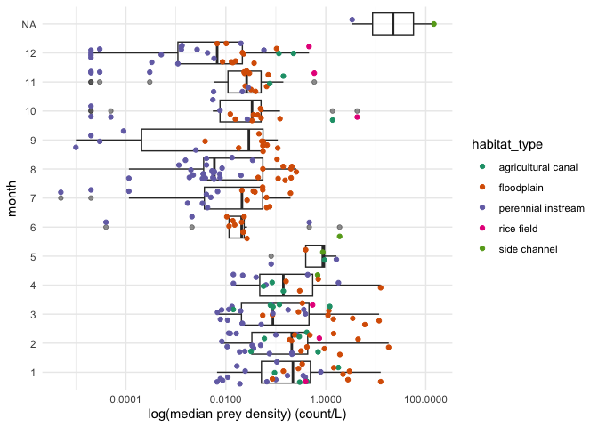
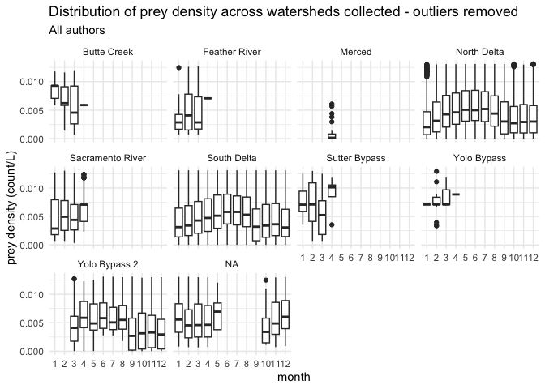
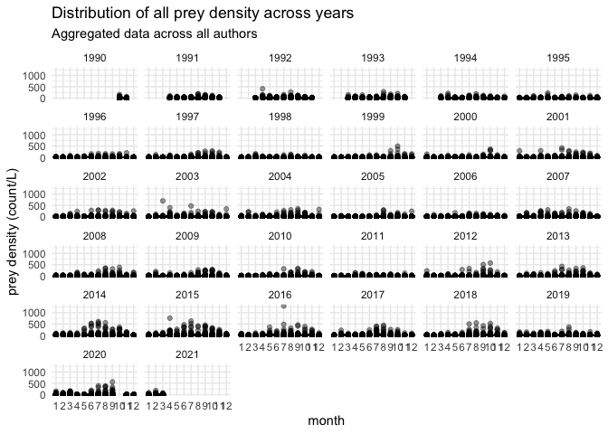

Prey Data Overview
================
Maddee Rubenson (FlowWest)
2022-12-27

## Prey Density

### Aggregate All Prey Data

``` r
all_prey_density <- bind_rows(preyDataProcessing::cordoleani_prey_data,
                      preyDataProcessing::zeug_merced_prey_data, 
                      preyDataProcessing::zeug_sanJoaquin_prey_data, 
                      preyDataProcessing::montgomery_prey_data, 
                      preyDataProcessing::guignard_prey_data, 
                      preyDataProcessing::corline_prey_data,
                      preyDataProcessing::zooper_prey_data) 

usethis::use_data(all_prey_density, overwrite = TRUE)
```

### Create Monthly Prey Density Dataset

**Notes:**

- There are two NAs associated with the month of San Joaquin data
  because data received was aggregated to year

``` r
# monthly aggregation by watershed,  habitat type -------------------------
## group by watershed, habitat type, year, month - summarize prey density (median, min, max)
monthly_prey_density <- all_prey_density %>%
  mutate(year = ifelse(!is.na(date), lubridate::year(date), 2016),
         month = lubridate::month(date)) %>%
  group_by(watershed, habitat_type, year, month) %>%
  summarise_at(vars(prey_density), .funs = c('min', 'max', 'median', 'var'), na.rm = TRUE) %>%
  ungroup() %>%
  rename(min_prey_density = min,
         max_prey_density = max,
         median_prey_density = median,
         var_prey_density = var) |> glimpse()
```

    ## Rows: 931
    ## Columns: 8
    ## $ watershed           <chr> "Butte Creek", "Butte Creek", "Butte Creek", "Butt…
    ## $ habitat_type        <chr> "agricultural canal", "agricultural canal", "agric…
    ## $ year                <dbl> 2021, 2021, 2021, 2019, 2019, 2019, 2019, 2020, 20…
    ## $ month               <dbl> 1, 2, 3, 1, 2, 3, 4, 1, 2, 3, 1, 2, 3, 1, 2, 3, 4,…
    ## $ min_prey_density    <dbl> 0.0948545220, 0.0378191521, 0.0035367765, 0.070735…
    ## $ max_prey_density    <dbl> 5.0747169, 11.3530526, 1.8155453, 5.5881069, 5.835…
    ## $ median_prey_density <dbl> 1.786426830, 0.416010673, 0.117758582, 2.776369563…
    ## $ var_prey_density    <dbl> 4.347130130, 8.718954614, 0.248814527, 8.762301827…

``` r
# save file for use in R package
usethis::use_data(monthly_prey_density, overwrite = TRUE)
```

<!-- ## Fish Data  -->
<!-- ```{r} -->
<!-- load('../data/all_fish_data.rda') -->
<!-- #all_fish_data <- all_fish_data %>% select(-lat, -lon) -->
<!-- #usethis::use_data(all_fish_data, overwrite = TRUE) -->
<!-- monthly_fish_data <- all_fish_data %>% -->
<!--   mutate(year = ifelse(!is.na(date), lubridate::year(date), 2016), -->
<!--          month = lubridate::month(date)) %>% -->
<!--   mutate(habitat_type = case_when(watershed == "Merced" ~ "perennial instream", -->
<!--                                   watershed != "Merced" ~ habitat_type)) %>% -->
<!--   group_by(watershed, habitat_type, year, month) %>% -->
<!--   summarise_at(vars(mass, fork_length), .funs = c('min', 'max', 'median'), na.rm = TRUE) %>% -->
<!--   ungroup() |> glimpse() -->
<!-- # save file for use in R package -->
<!-- # usethis::use_data(monthly_fish_data) -->
<!-- ``` -->
<!-- ## Environmental Data  -->
<!-- ```{r} -->
<!-- all_enviro <- preyDataProcessing::all_enviro_data %>% glimpse -->
<!-- ``` -->

# Explore Variables

## Authors

``` r
prey_agg_by_author <- preyDataProcessing::all_prey_density %>%
  group_by(author) %>%
  summarise_at(vars(prey_density), .funs = c('min', 'max', 'median', 'var'), na.rm = TRUE)

kable(prey_agg_by_author, digits = 1, caption = "summary statistics of prey density values across authors included in the prey data package")
```

| author       | min |    max | median |    var |
|:-------------|----:|-------:|-------:|-------:|
| Cordoleani   |   0 |  174.6 |    0.1 |  117.5 |
| Corline      |   0 |  108.5 |    0.6 |   80.3 |
| Guignard     |   0 |   26.7 |    0.8 |   15.2 |
| Montgomery   |   0 |  160.3 |    0.0 |   29.7 |
| Zeug         |   0 |  376.2 |    0.0 | 2693.0 |
| zooper: 20mm |   0 |  757.6 |    0.0 |    8.3 |
| zooper: EMP  |   0 | 1298.8 |    0.0 |  106.4 |
| zooper: FMWT |   0 |   47.5 |    0.0 |    2.7 |
| zooper: FRP  |   0 |  239.3 |    0.0 |   17.8 |
| zooper: STN  |   0 |  147.3 |    0.1 |   15.0 |

summary statistics of prey density values across authors included in the
prey data package

## Habitat Type

Habitat types included in the prey data package include:

- Agricultural canal
- Floodplain
- Perennial instream
- Side channel

Habitat types were assigned based on sampling locations provided by
authors where available. When no habitat types were provided by authors,
we assigned habitat type based on satellite imagery. Please see
(<https://github.com/CVPIA-OSC/preyDataProcessing/blob/for_review/data-raw/standard_format_markdowns/habitat_type_eda.html>)
for more details.

``` r
ggplot(all_prey_density, aes(x = as.factor(month(date)), y = prey_density)) + 
  geom_point(alpha = 0.4) + 
  facet_wrap(~habitat_type) + 
  xlab('month') +
  ylab('prey density (count/L)') + 
  ggtitle('Distribution of all prey density across years and habitat types', 
          subtitle = "Aggregated data across all authors") 
```

<!-- -->

``` r
monthly_prey_density |> 
  filter(median_prey_density > 0) |> 
ggplot() +
  geom_boxplot(aes(x = as.factor(month), y = median_prey_density), alpha = 0.5) +
  geom_jitter(aes(x = as.factor(month), y = median_prey_density, color = habitat_type)) +
  scale_y_continuous(trans='log10') +
  xlab('month') +
  ylab('log(median prey density) (count/L)') +
  scale_color_brewer(palette = 'Dark2') +
  coord_flip() 
```

<!-- -->

``` r
preyDataProcessing::all_prey_density %>%
  group_by(habitat_type) %>%
  summarise(author = paste0(unique(author), collapse = ", ")) %>% kable()
```

| habitat_type       | author                                                                                                             |
|:-------------------|:-------------------------------------------------------------------------------------------------------------------|
| agricultural canal | Cordoleani, Montgomery, Corline                                                                                    |
| floodplain         | Cordoleani, Montgomery, Guignard, Corline, zooper: FMWT, zooper: FRP, zooper: STN, zooper: 20mm                    |
| perennial instream | Cordoleani, Zeug, Montgomery, Guignard, Corline, zooper: EMP, zooper: FMWT, zooper: FRP, zooper: STN, zooper: 20mm |
| rice field         | Montgomery                                                                                                         |
| side channel       | Zeug, Guignard                                                                                                     |

``` r
all_prey_density %>%
  group_by(habitat_type, author) %>%
  select(prey_density) %>%
  summarise_if(is.numeric, .funs = c("mean", "min", "max", "var"), na.rm = TRUE) %>% 
  kable(digits=1, format.args = list(big.mark = ","))
```

| habitat_type       | author       |  mean |  min |     max |     var |
|:-------------------|:-------------|------:|-----:|--------:|--------:|
| agricultural canal | Cordoleani   |   0.5 |  0.0 |    11.4 |     1.9 |
| agricultural canal | Corline      |   0.3 |  0.0 |     5.4 |     0.6 |
| agricultural canal | Montgomery   |   2.1 |  0.0 |   160.3 |    84.5 |
| floodplain         | Cordoleani   |  10.1 |  0.0 |   174.6 |   555.5 |
| floodplain         | Corline      |   3.9 |  0.0 |   108.5 |    87.4 |
| floodplain         | Guignard     |   1.0 |  0.0 |     5.3 |     1.7 |
| floodplain         | Montgomery   |   1.2 |  0.0 |    67.9 |    18.3 |
| floodplain         | zooper: 20mm |   0.2 |  0.0 |    14.3 |     0.8 |
| floodplain         | zooper: FMWT |   0.5 |  0.0 |    20.7 |     1.8 |
| floodplain         | zooper: FRP  |   0.2 |  0.0 |    11.3 |     0.8 |
| floodplain         | zooper: STN  |   1.1 |  0.0 |    43.9 |     6.5 |
| perennial instream | Cordoleani   |   0.5 |  0.0 |   120.7 |     9.7 |
| perennial instream | Corline      |   0.0 |  0.0 |     0.3 |     0.0 |
| perennial instream | Guignard     |   3.7 |  0.0 |    23.1 |    26.7 |
| perennial instream | Montgomery   |   0.2 |  0.0 |   104.3 |     2.8 |
| perennial instream | Zeug         |   8.8 |  0.0 |   376.2 | 1,399.6 |
| perennial instream | zooper: 20mm |   0.3 |  0.0 |   757.6 |     8.5 |
| perennial instream | zooper: EMP  |   0.9 |  0.0 | 1,298.8 |   106.4 |
| perennial instream | zooper: FMWT |   0.4 |  0.0 |    47.5 |     2.9 |
| perennial instream | zooper: FRP  |   0.4 |  0.0 |   239.3 |    20.1 |
| perennial instream | zooper: STN  |   1.0 |  0.0 |   147.3 |    16.1 |
| rice field         | Montgomery   |   4.5 |  0.0 |   150.0 |   203.5 |
| side channel       | Guignard     |   2.9 |  0.0 |    26.7 |    23.2 |
| side channel       | Zeug         | 147.4 | 15.9 |   278.0 | 6,690.6 |

## Watersheds

There are 12 watersheds included in the monthly prey density data,
including:

- Butte Creek
- Feather River
- Merced
- North Delta
- Sacramento River
- San Joaquin River
- South Delta
- Stanislaus
- Sutter Bypass
- Yolo Bypass
- Yolo Bypass 2

``` r
all_prey_density |> 
  filter(prey_density > 0 & prey_density <= 0.0131) |> 
ggplot() +
  geom_boxplot(aes(x = as.factor(month(date)), y = prey_density)) +
  facet_wrap(~watershed) +
  ylab('prey density (count/L)') +
  xlab('month') +
  ggtitle('Distribution of prey density across watersheds collected - outliers removed',
          subtitle = "All authors")
```

<!-- -->

## Temporal Variation

``` r
all_prey_density |> 
  filter(!is.na(year(date))) |> 
ggplot(aes(x = as.factor(month(date)), y = prey_density)) + 
  geom_point(alpha = 0.4) +
  facet_wrap(~year(date)) +  
  xlab('month') +
  ylab('prey density (count/L)') + 
  ggtitle('Distribution of all prey density across years', 
          subtitle = "Aggregated data across all authors") 
```

<!-- -->

<!-- ## Fish Data -->
<!-- ```{r} -->
<!-- # mass -->
<!-- ggplot() + -->
<!--   geom_boxplot(data = monthly_fish_data, aes(x = as.factor(month), y = mass_median), alpha = 0.5) + -->
<!--   geom_jitter(data = monthly_fish_data, aes(x = as.factor(month), y = mass_median, color = habitat_type)) + -->
<!--   ylab('mass (grams)') + -->
<!--   xlab('month') + -->
<!--   scale_color_brewer(palette = 'Dark2')+ -->
<!--   coord_flip() -->
<!-- # fork length (mm) -->
<!-- ggplot() + -->
<!--   geom_boxplot(data = monthly_fish_data, aes(x = as.factor(month), y = fork_length_median), alpha = 0.5) + -->
<!--   geom_jitter(data = monthly_fish_data, aes(x = as.factor(month), y = fork_length_median, color = habitat_type)) + -->
<!--   ylab('fork length (mm)') + -->
<!--   xlab('month') + -->
<!--   scale_color_brewer(palette = 'Dark2')+ -->
<!--   coord_flip() -->
<!-- ``` -->
<!-- ## Environmental Data  -->
<!-- * Not aggregated by month -->
<!-- * Includes: dissolved oxygen, temperature and flow  -->
<!-- ```{r} -->
<!-- # temperature -->
<!-- all_enviro %>% filter(!is.na(temperature)) %>% -->
<!--   ggplot() + -->
<!--   geom_line(aes(x = date, y  = temperature)) +  -->
<!--   facet_wrap(~ author) + -->
<!--   ylab('temperature (celcius)') -->
<!-- # dissolved oxygen -->
<!-- all_enviro %>% filter(!is.na(do_mg_l)) %>% -->
<!--   ggplot() + -->
<!--   geom_line(aes(x = date, y  = do_mg_l)) +  -->
<!--   facet_wrap(~ author) + -->
<!--   ylab('dissolved oxygen (mg/l)') -->
<!-- # flow -->
<!-- all_enviro %>% filter(!is.na(flow_cfs)) %>% -->
<!--   ggplot() + -->
<!--   geom_line(aes(x = date, y  = flow_cfs)) +  -->
<!--   facet_wrap(~ author) + -->
<!--   ylab('flow_cfs') -->
<!-- ``` -->
