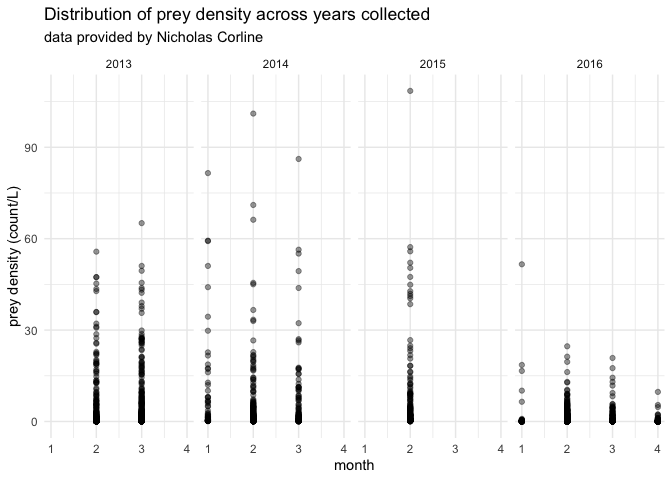
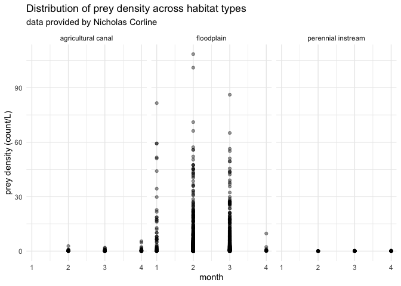

Nicholas Corline Data
================
Maddee Rubenson (FlowWest)
2022-12-20

## Corline Data Standarization

**Datasets provided:**

- Zoop2013_2016_NC.xlsx - this is the most up to date dataset used in
  the prey data aggregation
- Zoop2013_2016.xlsx
- Corline2017_Article_ZooplanktonEcologyAndTrophicRe.pdf

**Author contact info:**

Nicholas Corline \[njcorline@vt.edu\]

### Prey Data

Final prey density dataset includes the following variables:

- `date`: YYYY-MM-DD
- `gear_type`: the type of gear used to collect zooplankton.
- `species`: species of zooplankton
- `life_stage`: lifestage of zooplankton species
- `prey_density`: density of zooplankton (count/L)
- `size_class`: size class of zooplankton, determined by mesh size
- `mesh_size`: mesh size of net used to collect zooplankton
- `habitat_type`: habitat type of location where zooplankton were
  collected
- `lat`: latitude of sampling location
- `lon`: longitude of sampling location
- `site`: location description
- `author`: author of dataset
- `watershed`: unique watershed name associated with collected data

#### Raw data

``` r
corline_raw_zoop <- readxl::read_excel('../corline/Zoop2013_2016_NC.xlsx') |> glimpse()
#> Rows: 2,270
#> Columns: 26
#> $ Date                     <dttm> 2013-02-13, 2013-02-13, 2013-02-13, 2013-02-…
#> $ Location                 <chr> "Knaggs Ranch", "Knaggs Ranch", "Knaggs Ranch…
#> $ Field                    <chr> "Field 1", "Field 1", "Field 1", "Field 1", "…
#> $ Method                   <chr> "Net Throw", "Net Throw", "Net Throw", "Net T…
#> $ Throws                   <dbl> 4, 4, 4, 4, 4, 4, 4, 4, 4, 4, 4, 4, 4, 4, 4, …
#> $ `Mesh Size (microns)`    <dbl> 153, 153, 153, 153, 153, 153, 153, 153, 153, …
#> $ `Ring Size (cm)`         <dbl> 30, 30, 30, 30, 30, 30, 30, 30, 30, 30, 30, 3…
#> $ `Total Volume (ml)`      <dbl> 100, 100, 100, 100, 100, 100, 100, 100, 100, …
#> $ `Split Fraction`         <dbl> 1, 1, 1, 1, 1, 1, 1, 1, 1, 1, 1, 1, 1, 1, 1, …
#> $ `Volume subsampled (ml)` <dbl> 21.0, 21.0, 21.0, 21.0, 21.0, 21.0, 21.0, 21.…
#> $ Phylum                   <chr> "Arthopoda", "Arthopoda", "Arthopoda", "Artho…
#> $ Class                    <chr> NA, NA, NA, NA, NA, NA, NA, NA, NA, NA, NA, "…
#> $ Subclass                 <chr> NA, NA, NA, NA, NA, NA, NA, NA, "Copepoda", "…
#> $ Order                    <chr> "Cladocera", "Cladocera", "Cladocera", "Clado…
#> $ Family                   <chr> "Bosmina", "Chydoridae", "Daphniidae", "Daphn…
#> $ Genus                    <chr> "Bosmina", "chydorus", "Ceriodaphnia", "Daphn…
#> $ Species                  <chr> "Bosmina", "chydorus", "Ceriodaphnia", "pulex…
#> $ `Life Stage`             <chr> "adult", "adult", "adult", "adult", "adult", …
#> $ Count                    <dbl> 12, 38, 13, 30, 7, 1, 348, 5, 56, 384, 19, 21…
#> $ Field_Volume_m3          <dbl> 1.41, 1.41, 1.41, 1.41, 1.41, 1.41, 1.41, 1.4…
#> $ Inverse_Fraction         <dbl> 4.761905, 4.761905, 4.761905, 4.761905, 4.761…
#> $ Sample_Total_Count       <dbl> 57.142857, 180.952381, 61.904762, 142.857143,…
#> $ Ind_per_m3               <dbl> 40.526849, 128.335022, 43.904086, 101.317123,…
#> $ Ind_per_L                <dbl> 0.040526849, 0.128335022, 0.043904086, 0.1013…
#> $ ...25                    <lgl> NA, NA, NA, NA, NA, NA, NA, NA, NA, NA, NA, N…
#> $ ...26                    <chr> "Volume of a cylinder based on net ring diame…
```

#### Standard format

**excluded variables:**

- `Split Fraction`

- `Class`

- `Subclass`

- `Order`

- `Genus`

- `Family`

**notes:**

- Kept `species` column

- Fixed naming conventions of the sampling locations (`sample_id`)

- Defined prey density as `Ind_per_L` which was calculated as the ratio
  of field volume and sample totals

- Along with `gear_type` included in the dataset are the number of
  throws (`n_throws`) and mesh size (`mesh_size_microns`). Mesh size is
  used to determine the `size_class` variable.

``` r
corline_zoop_tmp <- corline_raw_zoop  |> 
  rename(location = Location, 
         gear_type = Method, 
         life_stage = `Life Stage`) |> 
  mutate(prey_density = Ind_per_L,
         Date = as_date(Date)) |> 
  select(-c(`Split Fraction`:`Volume subsampled (ml)`), -Count, -c(Phylum:Genus)) %>%
  rename(sample_id = Field, 
         species = Species, 
         n_throws = Throws, 
         mesh_size_microns = `Mesh Size (microns)`,
         date = Date) |> 
  select(-`Total Volume (ml)`, -`Ring Size (cm)`, -Ind_per_m3,
         -Ind_per_L, -...25, -...26, -Field_Volume_m3, -Inverse_Fraction, 
         -Sample_Total_Count) |> 
  mutate(author = "Corline",
         size_class = "meso",
         species = tolower(species),
         gear_type = tolower(gear_type),
         mesh_size = mesh_size_microns) 

# Numeric sample Ids must be standardized with Fields. Looks like 2015 data has 1 - 9 as sample Id while data from 2013 has Field 1 - Field 9. This is updated to have the sample_ids as follows, where the NA corresponds to the sites on the Sacramento River. 
tmp_change_names <- corline_zoop_tmp[corline_zoop_tmp$sample_id %in% c(1:10), ] %>%
  mutate(sample_id = paste0('Field ', sample_id))
tmp_names_with_field <- corline_zoop_tmp[!(corline_zoop_tmp$sample_id %in% c(1:10)), ]
corline_zoop_tmp <- bind_rows(tmp_change_names, tmp_names_with_field)

# this fixes the spelling differences in species column 
corline_zoop <- corline_zoop_tmp |> 
  mutate(species = case_when(species %in% c("harpacticoid", "harpacticoida") ~ "harpacticoida",
                             species %in% c("illyocryptidae", "ilyocryptidae") ~ "ilyocryptidae",
                             species %in% c("schaploberis", "schaphloberis") ~ "schaphloberis", 
                             species == "species" ~ NA_character_, 
                             TRUE ~ species))  |> 
  select(-n_throws, -mesh_size_microns) 
```

##### Locations Standard Format

**Notes:**

- location of the fields (Knaggs Ranch) were provided by author

- location of inlet canal (Toe Drain) was determined based on best
  professional judgement and guidance from the paper Corline et al.

- location of the Sacramento River sampling site was provided in the
  paper Corline et al. as Sherwood Harbor

- defined `habitat_type` based on best professional judgement from
  monitoring locations

``` r
corline_locations <- data.frame(
  location = c('Knaggs Ranch', 'Sacramento River', 'Toe Drain'),
  habitat_type = c('floodplain', 'perennial instream', 'agricultural canal'), # TODO update these habitat designations per recommendations from J. Montgomery
  lat = c(38.70151, 38.52353, 38.70511),
  lon = c( -121.66996, -121.53840, -121.67041)
)
```

##### Combine prey data with locations

This produces the final prey density dataset.

``` r

corline_zoop_final <- corline_zoop |> 
  left_join(corline_locations) |>  
   mutate(watershed = ifelse(location == "Sacramento River", "Sacramento River", "Yolo Bypass"),
         site = ifelse(location == "Sacramento River", "Sherwood Harbor", location)) %>%
  mutate(site = paste0(location, "-", sample_id)) %>%
  select(-sample_id, -location) 

kable(head(corline_zoop_final, 5))
```

| date       | gear_type | species      | life_stage | prey_density | author  | size_class | mesh_size | habitat_type |      lat |     lon | watershed   | site                 |
|:-----------|:----------|:-------------|:-----------|-------------:|:--------|:-----------|----------:|:-------------|---------:|--------:|:------------|:---------------------|
| 2014-01-31 | net throw | bosmina      | adult      |    0.8936170 | Corline | meso       |       153 | floodplain   | 38.70151 | -121.67 | Yolo Bypass | Knaggs Ranch-Field 2 |
| 2014-01-31 | net throw | chydoridae   | adult      |    0.3829787 | Corline | meso       |       153 | floodplain   | 38.70151 | -121.67 | Yolo Bypass | Knaggs Ranch-Field 2 |
| 2014-01-31 | net throw | chydorus     | adult      |   17.4893617 | Corline | meso       |       153 | floodplain   | 38.70151 | -121.67 | Yolo Bypass | Knaggs Ranch-Field 2 |
| 2014-01-31 | net throw | ceriodaphnia | adult      |    6.5106383 | Corline | meso       |       153 | floodplain   | 38.70151 | -121.67 | Yolo Bypass | Knaggs Ranch-Field 2 |
| 2014-01-31 | net throw | pulex        | adult      |   17.2340426 | Corline | meso       |       153 | floodplain   | 38.70151 | -121.67 | Yolo Bypass | Knaggs Ranch-Field 2 |

#### QC

**Notes:**

- all prey data was collected January through April

``` r
summary(corline_zoop_final)
#>       date             gear_type           species           life_stage       
#>  Min.   :2013-02-13   Length:2270        Length:2270        Length:2270       
#>  1st Qu.:2013-03-13   Class :character   Class :character   Class :character  
#>  Median :2014-03-12   Mode  :character   Mode  :character   Mode  :character  
#>  Mean   :2014-09-30                                                           
#>  3rd Qu.:2016-02-22                                                           
#>  Max.   :2016-04-18                                                           
#>   prey_density         author           size_class          mesh_size    
#>  Min.   :  0.0000   Length:2270        Length:2270        Min.   :153.0  
#>  1st Qu.:  0.1135   Class :character   Class :character   1st Qu.:153.0  
#>  Median :  0.5532   Mode  :character   Mode  :character   Median :153.0  
#>  Mean   :  3.5631                                         Mean   :153.5  
#>  3rd Qu.:  2.3626                                         3rd Qu.:154.0  
#>  Max.   :108.5106                                         Max.   :154.0  
#>  habitat_type            lat             lon          watershed        
#>  Length:2270        Min.   :38.52   Min.   :-121.7   Length:2270       
#>  Class :character   1st Qu.:38.70   1st Qu.:-121.7   Class :character  
#>  Mode  :character   Median :38.70   Median :-121.7   Mode  :character  
#>                     Mean   :38.69   Mean   :-121.7                     
#>                     3rd Qu.:38.70   3rd Qu.:-121.7                     
#>                     Max.   :38.71   Max.   :-121.5                     
#>      site          
#>  Length:2270       
#>  Class :character  
#>  Mode  :character  
#>                    
#>                    
#> 
```

#### Data exploration

``` r
ggplot(corline_zoop_final, aes(x = month(date), y = prey_density)) + 
  geom_point(alpha = 0.4) + 
  facet_grid(~year(date)) + 
  xlab('month') +
  ylab('prey density (count/L)') + 
  ggtitle('Distrubtion of prey density across years collected', 
          subtitle = "data provided by Nicholas Corline") 
```

<!-- -->

``` r

ggplot(corline_zoop_final, aes(x = month(date), y = prey_density)) + 
  geom_point(alpha = 0.4) + 
  facet_grid(~habitat_type + year(date)) + 
  xlab('month') +
  ylab('prey density (count/L)') + 
  ggtitle('Distrubtion of prey density across years and habitat types', 
          subtitle = "data provided by Nicholas Corline") 
```

<!-- -->

#### Save final dataset

``` r

#save(corline_zoop_final, file = "../../data/corline_prey_data.rda")

corline_prey_data <- corline_zoop_final
usethis::use_data(corline_prey_data, overwrite = TRUE)
```

## Upcoming Updates

- include fish weight metrics
- include environmental datasets
