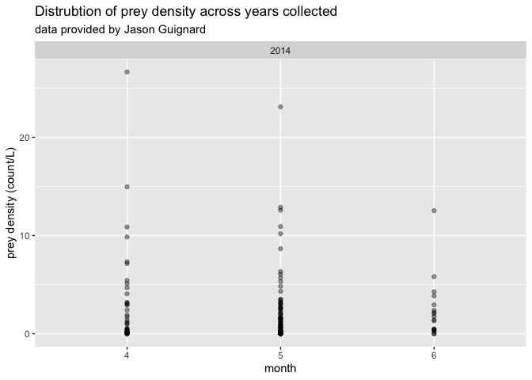
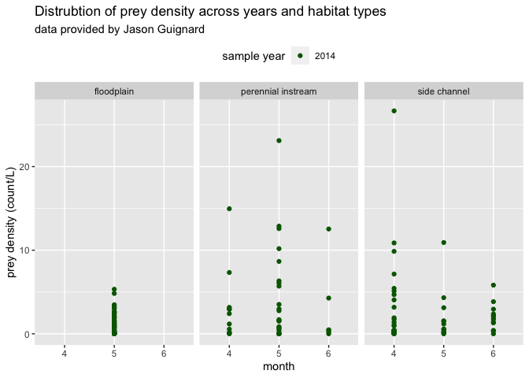

Jason Guignard Data
================
Maddee Rubenson (FlowWest)
2022-12-20

## Guignard Data Standardization

**Datasets provided:**

- `drift net sites_to_kml.kml`
- `Honolulu Bar data.xlsx`

**Author contact info:**

Jason Guignard \[jasonguignard@fishbio.com\]

### Prey Data

Final prey density dataset includes the following variables:

- `date`: YYYY-MM-DD
- `gear_type`: the type of gear used to collect zooplankton.
- `species`: species of zooplankton
- `prey_density`: density of zooplankton (count/L)
- `size_class`: size class of zooplankton, determined by mesh size
- `mesh_size`: mesh size of net used to collect zooplankton
- `habitat_type`: habitat type of location where zooplankton were
  collected
- `lat`: latitude of sampling location
- `lon`: longitude of sampling location
- `site`: location description
- `author`: author of dataset
- `watershed`: unique watershed name associated with collected data

#### Raw data

``` r
stanislaus_zoop_raw <- readxl::read_excel('../guignard/Honolulu Bar data.xlsx', sheet = 'Density by location, date,ta_MR') |> glimpse()
```

    ## Rows: 26
    ## Columns: 9
    ## $ Location               <chr> "Main Channel", "Main Channel", "Main Channel",…
    ## $ Date                   <dttm> 2014-04-04, 2014-04-14, 2014-05-01, 2014-05-09…
    ## $ `Total  Drift Density` <dbl> 0.6680000, 0.3470000, 0.8180000, 0.9700000, 0.7…
    ## $ Ephemeroptera          <dbl> 0.0841750842, 0.0157331655, 0.0200706487, 0.048…
    ## $ Plecoptera             <dbl> 0.0000000000, 0.0043703238, 0.0000000000, 0.000…
    ## $ Tricoptera             <dbl> 0.0026304714, 0.0034962590, 0.0000000000, 0.024…
    ## $ Diptera                <dbl> 0.423505892, 0.033214461, 0.044155427, 0.245098…
    ## $ Microcrustacea         <dbl> 0.08943603, 0.08259912, 0.65430315, 0.28835063,…
    ## $ `Other Taxa`           <dbl> 0.06825253, 0.20758667, 0.09947078, 0.36446367,…

#### Standard format

**excluded variables:**

- `prey_density_total` - chose to remove this and use the `prey_density`
  disaggregated by species

**notes:**

- Used `Total Drift Density` column as prey density value which needed
  to be converted from cubic feet to liters

- `site` = `location`

``` r
stanislaus_zoop <- stanislaus_zoop_raw %>%
  rename(location = Location,
         prey_density_total = `Total  Drift Density`,# units are cubic feet
         other_taxa = `Other Taxa`) %>%
  mutate(prey_density_total = prey_density_total/28.3168) %>%  #1ft^3 = 28.3168 Liters  # this is the sum of all species     
  gather(!c('location', 'prey_density_total', 'Date'), key = species, value = value )%>%
  mutate(author = 'Guignard',
         watershed = 'Stanislaus',
         species = tolower(species)) %>%
  rename(prey_density = value,
         date = Date) %>%
  mutate(prey_density = prey_density/0.0283168, 
         site = location,
         gear_type = "net throw",
         mesh_size = 335,
         size_class = "meso/macro") %>% # size class is 335 micrometer mesh. 
  select(-prey_density_total, -location) 
```

##### Locations Standard Format

**variables removed**

**notes:**

- Match names of locations to the `stanislaus_zoop` table and merge them
- Manually assign `habitat_type` using best professional judgement

``` r
locations_raw <- st_read(dsn = '../guignard/drift net sites_to_kml.kml') 
```

    ## Reading layer `Points' from data source 
    ##   `/Users/maddeerubenson/Documents/git/CVPIA/preyDataProcessing/data-raw/guignard/drift net sites_to_kml.kml' 
    ##   using driver `KML'
    ## Simple feature collection with 7 features and 2 fields
    ## Geometry type: POINT
    ## Dimension:     XYZ
    ## Bounding box:  xmin: -120.7274 ymin: 37.79741 xmax: -120.7254 ymax: 37.80054
    ## z_range:       zmin: 0 zmax: 0
    ## Geodetic CRS:  WGS 84

``` r
geometry <- sf::st_coordinates(locations_raw) |> 
  cbind(locations_raw) |> 
  rename(lon = X, 
         lat = Y) |> 
  select(-Z, -geometry, -Description) |> 
  sf::st_drop_geometry()

# locaton names of zoop data
unique(stanislaus_zoop$site)
```

    ## [1] "Main Channel"       "Top Side"           "Lower Side"        
    ## [4] "Lower Flood Plain"  "Middle Flood Plain" "Upper Flood Plain"

``` r
# location names in .kmz 
unique(geometry$Name)
```

    ## [1] "H Bar Main Channel"           "Floodplain Lower"            
    ## [3] "Floodplain Upper"             "Side Channel Lower"          
    ## [5] "Side Channel Upper"           "Middle Floodplain"           
    ## [7] "H Bar main abv. side channel"

``` r
# change the names of the locations dataset to match those in in the zoops table 
geometry[geometry$Name == "H Bar Main Channel", 'Name'] <- 'Main Channel'
geometry[geometry$Name == "Side Channel Upper", 'Name'] <- 'Top Side'
geometry[geometry$Name == "Side Channel Lower", 'Name'] <- 'Lower Side'
geometry[geometry$Name == "Floodplain Upper", 'Name'] <- 'Upper Flood Plain'
geometry[geometry$Name == "Middle Floodplain", 'Name'] <- 'Middle Flood Plain' 
geometry[geometry$Name == "Floodplain Lower", 'Name'] <- 'Lower Flood Plain'

locations <- geometry %>%
  mutate(habitat_type = ifelse(Name %in% c('Main Channel'), 'perennial instream', 
                               ifelse(Name %in% c('Top Side', 'Lower Side'), 'side channel',
                                      ifelse(Name %in% c('Upper Flood Plain', 'Middle Flood Plain', 'Lower Flood Plain'), 'floodplain', NA)))
  ) %>%
  rename(site = Name)
```

##### Combine prey data with locations

This produces the final prey density dataset.

``` r
guignard_prey_data_final <- stanislaus_zoop |> 
  left_join(locations) 

kable(head(guignard_prey_data_final, 5))
```

| date       | species       | prey_density | author   | watershed  | site         | gear_type | mesh_size | size_class |       lon |      lat | habitat_type       |
|:-----------|:--------------|-------------:|:---------|:-----------|:-------------|:----------|----------:|:-----------|----------:|---------:|:-------------------|
| 2014-04-04 | ephemeroptera |    2.9726199 | Guignard | Stanislaus | Main Channel | net throw |       335 | meso/macro | -120.7254 | 37.79934 | perennial instream |
| 2014-04-14 | ephemeroptera |    0.5556124 | Guignard | Stanislaus | Main Channel | net throw |       335 | meso/macro | -120.7254 | 37.79934 | perennial instream |
| 2014-05-01 | ephemeroptera |    0.7087894 | Guignard | Stanislaus | Main Channel | net throw |       335 | meso/macro | -120.7254 | 37.79934 | perennial instream |
| 2014-05-09 | ephemeroptera |    1.6971706 | Guignard | Stanislaus | Main Channel | net throw |       335 | meso/macro | -120.7254 | 37.79934 | perennial instream |
| 2014-05-13 | ephemeroptera |    1.5145534 | Guignard | Stanislaus | Main Channel | net throw |       335 | meso/macro | -120.7254 | 37.79934 | perennial instream |

#### QC

**Notes:**

- Data collected in April, May, and June of 2014

``` r
summary(guignard_prey_data_final)
```

    ##       date                       species           prey_density    
    ##  Min.   :2014-04-04 00:00:00   Length:156         Min.   : 0.0000  
    ##  1st Qu.:2014-04-14 00:00:00   Class :character   1st Qu.: 0.1001  
    ##  Median :2014-05-09 00:00:00   Mode  :character   Median : 0.8421  
    ##  Mean   :2014-05-08 07:23:04                      Mean   : 2.2665  
    ##  3rd Qu.:2014-05-15 00:00:00                      3rd Qu.: 2.6661  
    ##  Max.   :2014-06-30 00:00:00                      Max.   :26.6621  
    ##     author           watershed             site            gear_type        
    ##  Length:156         Length:156         Length:156         Length:156        
    ##  Class :character   Class :character   Class :character   Class :character  
    ##  Mode  :character   Mode  :character   Mode  :character   Mode  :character  
    ##                                                                             
    ##                                                                             
    ##                                                                             
    ##    mesh_size    size_class             lon              lat      
    ##  Min.   :335   Length:156         Min.   :-120.7   Min.   :37.8  
    ##  1st Qu.:335   Class :character   1st Qu.:-120.7   1st Qu.:37.8  
    ##  Median :335   Mode  :character   Median :-120.7   Median :37.8  
    ##  Mean   :335                      Mean   :-120.7   Mean   :37.8  
    ##  3rd Qu.:335                      3rd Qu.:-120.7   3rd Qu.:37.8  
    ##  Max.   :335                      Max.   :-120.7   Max.   :37.8  
    ##  habitat_type      
    ##  Length:156        
    ##  Class :character  
    ##  Mode  :character  
    ##                    
    ##                    
    ## 

#### Data exploration

``` r
ggplot(guignard_prey_data_final, aes(x = as.factor(month(date)), y = prey_density)) + 
  geom_point(alpha = 0.4) + 
  facet_grid(~year(date)) + 
  xlab('month') +
  ylab('prey density (count/L)') + 
  ggtitle('Distrubtion of prey density across years collected', 
          subtitle = "data provided by Jason Guignard") 
```

<!-- -->

``` r
ggplot(guignard_prey_data_final, aes(x = as.factor(month(date)), y = prey_density)) + 
  geom_point(aes(color = as.factor(year(date))), alpha = 0.4) + 
  facet_wrap(~habitat_type) + 
  xlab('month') +
  ylab('prey density (count/L)') + 
  ggtitle('Distrubtion of prey density across years and habitat types', 
          subtitle = "data provided by Jason Guignard") +  
  scale_color_manual('sample year', values=c('darkgreen', 'darkblue', "darkred")) + 
  theme(legend.position = "top")
```

<!-- -->

#### Save final dataset

``` r
guignard_prey_data <- guignard_prey_data_final
usethis::use_data(guignard_prey_data, overwrite = TRUE)
```

## Upcoming Updates

NA
