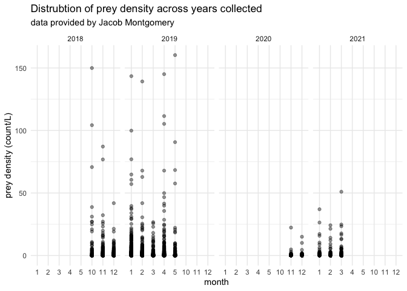
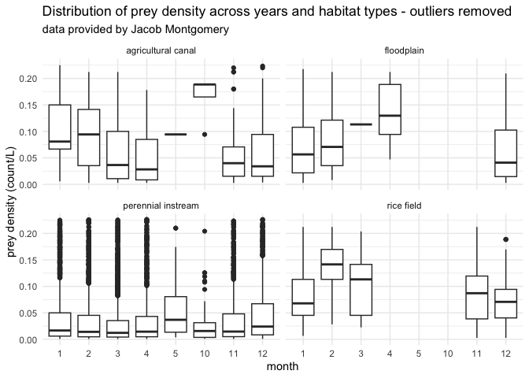

Jacob Montgomery Data
================
Maddee Rubenson (FlowWest)
2022-12-22

## Montgomery Data Standardization

**Datasets provided:**

- [Fish Food on Floodplain Farm Fields 2019 and
  2021](https://portal.edirepository.org/nis/mapbrowse?packageid=edi.996.2)

**Author contact info:**

Jacob Montgomery \[[jacob@caltrout.org](jacob@caltrout.org)\]

### Prey Data

Final prey density dataset includes the following variables:

- `date`: YYYY-MM-DD
- `gear_type`: the type of gear used to collect zooplankton.
- `species`: species of zooplankton
- `life_stage`: lifestage of zooplankton species
- `prey_density`: density of zooplankton (count/L)
- `size_class`: size class of zooplankton, determined by mesh size
- `mesh_size`: mesh size of net used to collect zooplankton
- `habitat_type`: habitat type of location where zooplankton were
  collected
- `lat`: latitude of sampling location
- `lon`: longitude of sampling location
- `site`: location description
- `author`: author of dataset

#### Raw data

``` r
# this a script that sources the EDI data
source('data-raw//montgomery/food_4_fish_data_access.R')

montgomery_prey_data |> glimpse()
```

    ## Rows: 638
    ## Columns: 71
    ## $ id                         <chr> "MNT3ASource_10/1/2018_8:00", "MNTNEWCAN_4/…
    ## $ pseudodiptomus_adult       <dbl> 0.000000, 0.000000, 0.000000, 0.000000, 0.0…
    ## $ psedodiptomus_copepidite   <dbl> 0.000000, 11.317685, 14.634937, 0.000000, 0…
    ## $ acanthocyclops_adult       <dbl> 0.000000, 2.829421, 126.836123, 8.488264, 1…
    ## $ acanthocyclops_copepididte <dbl> 19.80595, 178.25354, 1170.35150, 234.84196,…
    ## $ cyclopoid_sp               <dbl> 0, 0, 0, 0, 0, 0, 0, 0, 0, 0, 0, 0, 0, 0, 0…
    ## $ cyclopoid_nauplii          <dbl> 0.000000, 5.658842, 0.000000, 0.000000, 84.…
    ## $ calanoid_naulpii           <dbl> 0.000000, 5.658842, 121.957811, 2.829421, 0…
    ## $ harpaticoid                <dbl> 0.000000, 0.000000, 9.756625, 0.000000, 0.0…
    ## $ daphnia_pulex              <dbl> 11.317685, 0.000000, 0.000000, 14.147106, 0…
    ## $ daphnia_laevis             <dbl> 0, 0, 0, 0, 0, 0, 0, 0, 0, 0, 0, 0, 0, 0, 0…
    ## $ daphnia_magna              <dbl> 0.00000, 0.00000, 0.00000, 0.00000, 0.00000…
    ## $ daphnia_mendotea           <dbl> 0, 0, 0, 0, 0, 0, 0, 0, 0, 0, 0, 0, 0, 0, 0…
    ## $ ceriodaphnia_sp            <dbl> 5.658842, 73.564951, 439.048119, 8.488264, …
    ## $ simocephalus_sp            <dbl> 0.000000, 0.000000, 19.513250, 0.000000, 0.…
    ## $ bosmina_sp                 <dbl> 8.488264, 22.635370, 204.889122, 11.317685,…
    ## $ sididae                    <dbl> 0.000000, 0.000000, 0.000000, 0.000000, 0.0…
    ## $ chydorus_sphaericus        <dbl> 2.829421, 246.159645, 282.942121, 53.759003…
    ## $ eurycercus                 <dbl> 0.00000, 0.00000, 0.00000, 0.00000, 0.00000…
    ## $ alona                      <dbl> 2.829421, 59.417845, 29.269875, 5.658842, 1…
    ## $ chydoridae                 <dbl> 0, 0, 0, 0, 0, 0, 0, 0, 0, 0, 0, 0, 0, 0, 0…
    ## $ diaphanosoma               <dbl> 0, 0, 0, 0, 0, 0, 0, 0, 0, 0, 0, 0, 0, 0, 0…
    ## $ scapholeberis              <dbl> 0, 0, 0, 0, 0, 0, 0, 0, 0, 0, 0, 0, 0, 0, 0…
    ## $ cladocera_embryo           <dbl> 16.976527, 5.658842, 97.566249, 0.000000, 1…
    ## $ eucypris                   <dbl> 0.000000, 5.658842, 0.000000, 0.000000, 169…
    ## $ ilyocypris                 <dbl> 0.000000, 0.000000, 9.756625, 0.000000, 0.0…
    ## $ cypridopsis                <dbl> 0.000000, 11.317685, 0.000000, 0.000000, 84…
    ## $ gammarus                   <dbl> 0.000000, 0.000000, 19.513250, 0.000000, 0.…
    ## $ rotifer                    <dbl> 0.000000, 48.100161, 411.552176, 31.123633,…
    ## $ polychaete                 <dbl> 0, 0, 0, 0, 0, 0, 0, 0, 0, 0, 0, 0, 0, 0, 0…
    ## $ acari                      <dbl> 0, 0, 0, 0, 0, 0, 0, 0, 0, 0, 0, 0, 0, 0, 0…
    ## $ chironomid_larvae          <dbl> 2.829421, 0.000000, 24.391562, 0.000000, 0.…
    ## $ oliogochaete               <dbl> 0.000000, 0.000000, 0.000000, 0.000000, 0.0…
    ## $ gastropod                  <dbl> 8.488264, 0.000000, 0.000000, 0.000000, 0.0…
    ## $ tardigrade                 <dbl> 0.000000, 0.000000, 14.634937, 0.000000, 0.…
    ## $ nematode                   <dbl> 2.829421, 0.000000, 0.000000, 0.000000, 0.0…
    ## $ hyalella                   <dbl> 0, 0, 0, 0, 0, 0, 0, 0, 0, 0, 0, 0, 0, 0, 0…
    ## $ hydra                      <dbl> 0.000000, 8.488264, 14.634937, 0.000000, 0.…
    ## $ terrestrial_insect         <dbl> 0.000000, 0.000000, 4.878312, 0.000000, 0.0…
    ## $ collembola                 <dbl> 0.000000, 0.000000, 4.878312, 0.000000, 0.0…
    ## $ baetidae                   <dbl> 0.000000, 0.000000, 0.000000, 0.000000, 0.0…
    ## $ diptera                    <dbl> 2.829421, 0.000000, 4.878312, 0.000000, 169…
    ## $ hydroptilidae              <dbl> 0.000000, 0.000000, 0.000000, 0.000000, 0.0…
    ## $ coleoptera                 <dbl> 0.000000, 0.000000, 0.000000, 0.000000, 0.0…
    ## $ ephemerellidae             <dbl> 0, 0, 0, 0, 0, 0, 0, 0, 0, 0, 0, 0, 0, 0, 0…
    ## $ odonata                    <dbl> 0.00000, 0.00000, 0.00000, 0.00000, 0.00000…
    ## $ bivalve                    <dbl> 0, 0, 0, 0, 0, 0, 0, 0, 0, 0, 0, 0, 0, 0, 0…
    ## $ trichoptera                <dbl> 2.829421, 0.000000, 48.783124, 0.000000, 0.…
    ## $ corixidae                  <dbl> 0.0000, 0.0000, 0.0000, 0.0000, 0.0000, 0.0…
    ## $ fish_larvae                <dbl> 0, 0, 0, 0, 0, 0, 0, 0, 0, 0, 0, 0, 0, 0, 0…
    ## $ streblocerus               <dbl> 0.00000, 0.00000, 0.00000, 0.00000, 0.00000…
    ## $ amphipod                   <dbl> 0, 0, 0, 0, 0, 0, 0, 0, 0, 0, 0, 0, 0, 0, 0…
    ## $ date                       <chr> "1/10/2018", "8/4/2019", "5/11/2018", "8/4/…
    ## $ location                   <chr> "MNT3ASource", "MNTNEWCAN", "ACCSAC2", "ELD…
    ## $ time                       <time> 08:00:00, 08:25:00, 12:30:00, 11:40:00, 08…
    ## $ temp_c                     <dbl> 18.563, 18.512, 15.000, 13.262, 17.270, 15.…
    ## $ ec_s_cm                    <dbl> 812.6, 877.8, 121.3, 114.3, 826.5, 115.4, 1…
    ## $ spc_s_cm                   <dbl> 926.1, 1001.7, 148.4, 147.5, 968.7, 141.4, …
    ## $ tds_mg_l                   <dbl> 602, 651, 96, 96, 630, 92, 92, 717, 651, 63…
    ## $ salinity_psu               <dbl> 0.46, 0.50, 0.07, 0.07, 0.48, 0.07, 0.07, 0…
    ## $ do_sat                     <dbl> 41.6, 98.6, 101.4, 98.4, 95.8, 96.9, 96.9, …
    ## $ do_mg_l                    <dbl> 3.89, 9.20, 10.09, 10.33, 9.17, 9.70, 9.71,…
    ## $ p_h                        <dbl> 7.61, 7.34, 7.78, 7.41, 7.29, 7.50, 7.52, 7…
    ## $ turbidity_ntu              <dbl> 2.98, 6.28, 2.54, 27.67, 8.40, 2.34, 2.22, …
    ## $ chl_g_l                    <dbl> 1.16, 2.07, 1.49, 1.24, 2.06, 1.09, 1.29, 2…
    ## $ bga_g_l                    <dbl> 0.14, 0.15, 0.22, 0.30, 0.31, 0.33, 0.36, 0…
    ## $ start_rotation             <dbl> 0, 0, 0, 0, 0, 0, 0, 0, 0, 0, 0, 0, 0, 0, 0…
    ## $ end_rotation               <dbl> 0, 0, 0, 0, 0, 0, 0, 0, 0, 0, 0, 0, 0, 0, 0…
    ## $ zoop_score_1_10            <dbl> 1, 1, 1, 1, 2, 1, NA, 1, 2, 1, 7, 8, 1, 2, …
    ## $ notes                      <chr> NA, NA, NA, NA, NA, NA, NA, NA, NA, NA, NA,…
    ## $ volume_sampled             <dbl> 0.3534292, 0.3534292, 0.3534292, 0.3534292,…

#### Standard format

**excluded variables:**

- removed environmental variables like salinity, turbidity
- `start_rotation`
- `end_rotation`
- `notes`
- `zoop_score_1_10`
- `time`

**notes:**

- converted from count/m^3 to count/L
- extracted `temperature` and `dissolved oxygen` from prey density
  dataset but will include them in environmental dataset

``` r
montgomery_prey_data_process <- montgomery_prey_data %>%
  separate(id, c('location', 'Date'), '_') %>% 
  mutate(date = mdy(Date)) %>% 
  gather(!c('location', 'Date', 'date':'volume_sampled'), key = species, value = value) %>%
  separate(species, c('species', 'life_stage'), '_') %>%
  select(-c(Date, ec_s_cm:do_sat, p_h:volume_sampled)) %>%
  rename(temperature = temp_c,
         prey_density = value) %>%
  mutate(author = "Montgomery", 
         site = location,
         size_class = "meso",
         gear_type = "net throw",
         mesh_size = 150,
        prey_density = prey_density/1000) |> #1 m^3 = 1000 L 
  select(date, site, species:author, size_class, mesh_size, gear_type) 
```

##### Locations Standard Format

**variables removed**

- `purpose`

- `habitat_type`: this is the habitat type originally defined by
  Montgomery but redefined to fit this project needs

**notes:**

``` r
locations <- readxl::read_excel('data-raw/montgomery/F4F2021_LocationLookupTable_20221108.xlsx') |> janitor::clean_names() |> 
  separate(lat_lon_utm, sep = ", ", c("lat", "lon")) |> 
  select(-x3, -purpose, -habitat_type) |> 
  rename(habitat_type = habitat_type_2,
         site = location) |> 
  mutate(habitat_type = tolower(habitat_type),
         lat = as.numeric(lat),
         lon = as.numeric(lon)) |> glimpse()
```

    ## Rows: 46
    ## Columns: 4
    ## $ site         <chr> "ACC", "ACCSAC1", "ACCSAC2", "ACCSAC3", "ACCSAC4", "ELDCA…
    ## $ lat          <dbl> 38.78183, 38.78170, 38.77818, 38.77412, 38.76663, 38.8562…
    ## $ lon          <dbl> -121.6043, -121.6078, -121.6020, -121.5984, -121.5936, -1…
    ## $ habitat_type <chr> "perennial instream", "perennial instream", "perennial in…

##### Combine prey data with locations

This produces the final prey density dataset.

``` r
montgomery_prey_data_final <- montgomery_prey_data_process |> 
  left_join(locations) |> 
  filter(!is.na(habitat_type)) |> # filters out site MNT3ASource which has a prey_density of 0 and no site location or habitat type
  filter(prey_density > 0) 

kable(head(montgomery_prey_data_final, 5))
```

| date       | site       | species        | life_stage | prey_density | author     | size_class | mesh_size | gear_type |      lat |       lon | habitat_type       |
|:-----------|:-----------|:---------------|:-----------|-------------:|:-----------|:-----------|----------:|:----------|---------:|----------:|:-------------------|
| 2019-04-15 | MNTNEWCAN  | pseudodiptomus | adult      |    0.0056588 | Montgomery | meso       |       150 | net throw | 38.94108 | -121.6344 | agricultural canal |
| 2019-04-15 | KNG6       | pseudodiptomus | adult      |    0.2829421 | Montgomery | meso       |       150 | net throw | 38.70057 | -121.6694 | floodplain         |
| 2018-11-05 | MNTNEWCAN2 | pseudodiptomus | adult      |    0.4951487 | Montgomery | meso       |       150 | net throw | 38.94821 | -121.6345 | agricultural canal |
| 2019-02-04 | ACCSAC4    | pseudodiptomus | adult      |    0.0032153 | Montgomery | meso       |       150 | net throw | 38.76663 | -121.5936 | perennial instream |
| 2019-03-10 | KNGCAN     | pseudodiptomus | adult      |    0.1768388 | Montgomery | meso       |       150 | net throw | 38.70160 | -121.6706 | agricultural canal |

#### QC

**Notes:**

``` r
summary(montgomery_prey_data_final)
```

    ##       date                site             species           life_stage       
    ##  Min.   :2018-10-30   Length:9353        Length:9353        Length:9353       
    ##  1st Qu.:2019-01-07   Class :character   Class :character   Class :character  
    ##  Median :2019-02-11   Mode  :character   Mode  :character   Mode  :character  
    ##  Mean   :2019-02-07                                                           
    ##  3rd Qu.:2019-03-20                                                           
    ##  Max.   :2019-05-07                                                           
    ##   prey_density          author           size_class          mesh_size  
    ##  Min.   :  0.00068   Length:9353        Length:9353        Min.   :150  
    ##  1st Qu.:  0.00874   Class :character   Class :character   1st Qu.:150  
    ##  Median :  0.04171   Mode  :character   Mode  :character   Median :150  
    ##  Mean   :  0.82691                                         Mean   :150  
    ##  3rd Qu.:  0.22635                                         3rd Qu.:150  
    ##  Max.   :160.28995                                         Max.   :150  
    ##   gear_type              lat             lon         habitat_type      
    ##  Length:9353        Min.   :38.70   Min.   :-122.0   Length:9353       
    ##  Class :character   1st Qu.:38.78   1st Qu.:-121.7   Class :character  
    ##  Mode  :character   Median :38.80   Median :-121.7   Mode  :character  
    ##                     Mean   :38.83   Mean   :-121.7                     
    ##                     3rd Qu.:38.86   3rd Qu.:-121.6                     
    ##                     Max.   :39.14   Max.   :-121.6

#### Data exploration

##### All prey density data

``` r
ggplot(montgomery_prey_data_final, aes(x = as.factor(month(date)), y = prey_density)) + 
  geom_point(alpha = 0.4) + 
  facet_grid(~year(date)) + 
  xlab('month') +
  ylab('prey density (count/L)') + 
  ggtitle('Distrubtion of prey density across years collected', 
          subtitle = "data provided by Jacob Montgomery") 
```

<!-- -->

``` r
ggplot(montgomery_prey_data_final, aes(x = as.factor(month(date)), y = prey_density)) + 
  geom_point(aes(color = as.factor(year(date))), alpha = 0.4) + 
  facet_wrap(~habitat_type) + 
  xlab('month') +
  ylab('prey density (count/L)') + 
  ggtitle('Distrubtion of prey density across years and habitat types', 
          subtitle = "data provided by Jacob Montgomery") +  
  scale_color_manual('sample year', values=c('darkgreen', 'darkblue')) + 
  theme(legend.position = "top")
```

<!-- -->

##### Subset of prey density data with outliers removed

``` r
montgomery_prey_data_final |> 
  filter(prey_density <= 0.22635 & prey_density > 0) |> 
ggplot(aes(x = as.factor(month(date)), y = prey_density)) + 
  geom_boxplot(alpha = 0.4) + 
  facet_grid(~year(date)) + 
  xlab('month') +
  ylab('prey density (count/L)') + 
  ggtitle('Distribution of prey density across years collected - outliers removed', 
          subtitle = "data provided by Jacob Montgomery") 
```

<!-- -->

``` r
montgomery_prey_data_final |> 
  filter(prey_density <= 0.22635 & prey_density > 0) |> 
ggplot(aes(x = as.factor(month(date)), y = prey_density)) + 
  geom_boxplot(aes(color = as.factor(year(date))), alpha = 0.4) + 
  facet_wrap(~habitat_type) + 
  xlab('month') +
  ylab('prey density (count/L)') + 
  ggtitle('Distribution of prey density across years and habitat types - outliers removed', 
          subtitle = "data provided by Jacob Montgomery") +  
  scale_color_manual('sample year', values=c('darkgreen', 'darkblue')) +
  theme(legend.position = "top")
```

<!-- -->

#### Save final dataset

``` r
# save(montgomery_prey_data_final, file = "../../data/montgomery_prey_data.rda")

montgomery_prey_data <- montgomery_prey_data_final
usethis::use_data(montgomery_prey_data, overwrite = TRUE)
```

## Upcoming Updates

- include fish weight metrics
- include environmental datasets
