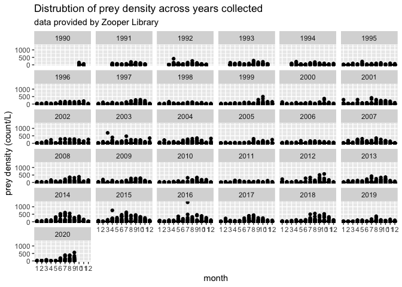
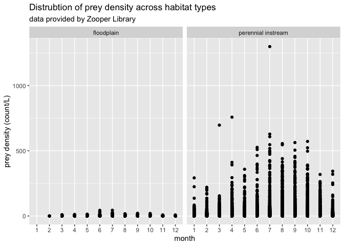

Zooper Data
================
Maddee Rubenson (FlowWest)
2022-12-20

## Zooper Data Standardization

**Datasets provided:**

- Data downloaded from Zooper library \[[Intergency Ecological
  Program](https://github.com/InteragencyEcologicalProgram/zooper)\]

**Author contact info:**

- NA

### Prey Data

Final prey density dataset includes the following variables:

- `date`: YYYY-MM-DD
- `species`: species of zooplankton
- `prey_density`: density of zooplankton (count/L)
- `size_class`: size class of zooplankton, determined by mesh size
- `habitat_type`: habitat type of location where zooplankton were
  collected
- `lat`: latitude of sampling location
- `lon`: longitude of sampling location
- `site`: location description
- `author`: author of dataset
- `watershed`: unique watershed name associated with collected data

#### Raw data

``` r

# run the Zooper libary query: 
# zoop_data <- Zoopsynther(Data_type = "Community", 
#                        Sources = c("EMP", "FRP", 
#                                    "FMWT", "STN", "20mm"), 
#                        Size_class = c("Micro", "Meso", "Macro"), 
#                        Date_range = c("1990-10-01", "2020-09-30"))

# save the zooper results: 
#saveRDS(zoop_data, 'zoop_data.rds')

# read pre-saved rds file back in:
path <- system.file("extdata", "zooper", "zoop_data.rds", package = "preyDataProcessing")
zoop_data <- readRDS(path) 

zoop_data |>  glimpse()
#> Rows: 1,126,004
#> Columns: 33
#> $ Source       <chr> "EMP", "EMP", "EMP", "EMP", "EMP", "EMP", "EMP", "EMP", "EMP", "EMP", "EMP", "EMP", "EMP", "EMP", "EMP", "EMP", "EMP", "E…
#> $ SizeClass    <chr> "Macro", "Macro", "Macro", "Macro", "Macro", "Macro", "Macro", "Macro", "Macro", "Macro", "Macro", "Macro", "Macro", "Mac…
#> $ Volume       <dbl> 2.155777, 2.155777, 2.155777, 2.155777, 2.155777, 2.155777, 2.155777, 2.155777, 2.155777, 2.155777, 2.155777, 2.155777, 2…
#> $ Lifestage    <chr> "Adult", "Adult", "Adult", "Adult", "Adult", "Adult", "Adult", "Adult", "Adult", "Adult", "Adult", "Adult", "Adult", "Adu…
#> $ Taxname      <chr> "Alienacanthomysis macropsis", "Americorophium spinicorne", "Americorophium stimpsoni", "Amphipoda_UnID", "Corophiidae_Un…
#> $ Taxlifestage <chr> "Alienacanthomysis macropsis Adult", "Americorophium spinicorne Adult", "Americorophium stimpsoni Adult", "Amphipoda_UnID…
#> $ SampleID     <chr> "EMP NZ092 2015-03-12", "EMP NZ092 2015-03-12", "EMP NZ092 2015-03-12", "EMP NZ092 2015-03-12", "EMP NZ092 2015-03-12", "…
#> $ CPUE         <dbl> 0.00, 0.17, 0.00, 0.00, 0.08, 0.00, 0.00, 0.20, 0.00, 0.02, 0.00, 0.00, 0.00, 0.00, 0.00, 0.00, 0.00, 0.00, 0.00, 0.00, 0…
#> $ Phylum       <chr> "Arthropoda", "Arthropoda", "Arthropoda", "Arthropoda", "Arthropoda", "Arthropoda", "Arthropoda", "Arthropoda", "Arthropo…
#> $ Class        <chr> "Malacostraca", "Malacostraca", "Malacostraca", "Malacostraca", "Malacostraca", "Malacostraca", "Malacostraca", "Malacost…
#> $ Order        <chr> "Mysida", "Amphipoda", "Amphipoda", "Amphipoda", "Amphipoda", "Amphipoda", "Mysida", "Amphipoda", "Amphipoda", "Mysida", …
#> $ Family       <chr> "Mysidae", "Corophiidae", "Corophiidae", NA, "Corophiidae", "Crangonycitidae", "Mysidae", "Gammaridae", "Hyalellidae", "M…
#> $ Genus        <chr> "Alienacanthomysis", "Americorophium", "Americorophium", NA, NA, "Crangonyx", "Deltamysis", "Gammarus", "Hyalella", "Hype…
#> $ Species      <chr> "macropsis", "spinicorne", "stimpsoni", NA, NA, NA, "holmquistae", NA, NA, "longirostris", NA, "kadiakensis", "mercedis",…
#> $ Undersampled <lgl> FALSE, FALSE, FALSE, FALSE, FALSE, FALSE, FALSE, FALSE, FALSE, FALSE, FALSE, FALSE, FALSE, FALSE, FALSE, FALSE, FALSE, FA…
#> $ Date         <dttm> 2015-03-12, 2015-03-12, 2015-03-12, 2015-03-12, 2015-03-12, 2015-03-12, 2015-03-12, 2015-03-12, 2015-03-12, 2015-03-12, …
#> $ Station      <chr> "NZ092", "NZ092", "NZ092", "NZ092", "NZ092", "NZ092", "NZ092", "NZ092", "NZ092", "NZ092", "NZ092", "NZ092", "NZ092", "NZ0…
#> $ Chl          <dbl> 3.18, 3.18, 3.18, 3.18, 3.18, 3.18, 3.18, 3.18, 3.18, 3.18, 3.18, 3.18, 3.18, 3.18, 3.18, 3.18, 3.92, 3.92, 3.92, 3.92, 3…
#> $ Secchi       <dbl> 104, 104, 104, 104, 104, 104, 104, 104, 104, 104, 104, 104, 104, 104, 104, 104, 112, 112, 112, 112, 112, 112, 112, 112, 1…
#> $ Temperature  <dbl> 15.7, 15.7, 15.7, 15.7, 15.7, 15.7, 15.7, 15.7, 15.7, 15.7, 15.7, 15.7, 15.7, 15.7, 15.7, 15.7, 21.5, 21.5, 21.5, 21.5, 2…
#> $ BottomDepth  <dbl> 9.260243, 9.260243, 9.260243, 9.260243, 9.260243, 9.260243, 9.260243, 9.260243, 9.260243, 9.260243, 9.260243, 9.260243, 9…
#> $ Tide         <chr> "High slack", "High slack", "High slack", "High slack", "High slack", "High slack", "High slack", "High slack", "High sla…
#> $ Year         <dbl> 2015, 2015, 2015, 2015, 2015, 2015, 2015, 2015, 2015, 2015, 2015, 2015, 2015, 2015, 2015, 2015, 2012, 2012, 2012, 2012, 2…
#> $ Datetime     <dttm> 2015-03-12 11:40:00, 2015-03-12 11:40:00, 2015-03-12 11:40:00, 2015-03-12 11:40:00, 2015-03-12 11:40:00, 2015-03-12 11:4…
#> $ Turbidity    <dbl> NA, NA, NA, NA, NA, NA, NA, NA, NA, NA, NA, NA, NA, NA, NA, NA, NA, NA, NA, NA, NA, NA, NA, NA, NA, NA, NA, NA, NA, NA, N…
#> $ Microcystis  <chr> NA, NA, NA, NA, NA, NA, NA, NA, NA, NA, NA, NA, NA, NA, NA, NA, NA, NA, NA, NA, NA, NA, NA, NA, NA, NA, NA, NA, NA, NA, N…
#> $ pH           <dbl> NA, NA, NA, NA, NA, NA, NA, NA, NA, NA, NA, NA, NA, NA, NA, NA, NA, NA, NA, NA, NA, NA, NA, NA, NA, NA, NA, NA, NA, NA, N…
#> $ DO           <dbl> NA, NA, NA, NA, NA, NA, NA, NA, NA, NA, NA, NA, NA, NA, NA, NA, NA, NA, NA, NA, NA, NA, NA, NA, NA, NA, NA, NA, NA, NA, N…
#> $ AmphipodCode <chr> "A", "A", "A", "A", "A", "A", "A", "A", "A", "A", "A", "A", "A", "A", "A", "A", "B", "B", "B", "B", "B", "B", "B", "B", "…
#> $ SalSurf      <dbl> 0.3764466, 0.3764466, 0.3764466, 0.3764466, 0.3764466, 0.3764466, 0.3764466, 0.3764466, 0.3764466, 0.3764466, 0.3764466, …
#> $ SalBott      <dbl> 0.4042861, 0.4042861, 0.4042861, 0.4042861, 0.4042861, 0.4042861, 0.4042861, 0.4042861, 0.4042861, 0.4042861, 0.4042861, …
#> $ Latitude     <dbl> 37.97833, 37.97833, 37.97833, 37.97833, 37.97833, 37.97833, 37.97833, 37.97833, 37.97833, 37.97833, 37.97833, 37.97833, 3…
#> $ Longitude    <dbl> -121.3819, -121.3819, -121.3819, -121.3819, -121.3819, -121.3819, -121.3819, -121.3819, -121.3819, -121.3819, -121.3819, …
```

#### Standard format

**excluded variables:**

- removed environmental variables

- `CPUE`

- `Phylum`

- `Class`

- `Order`

- `Family`

- `Genus`

- `Volume`

- `Undersampled`

**notes:**

- convert from count/m^3 to count/L
- extract `temperature` into unique environmental dataset
- `Taxname`= `species`

``` r
zooper <- zoop_data %>%
  select(date = Date, prey_per_unit_volume = CPUE, species = Taxname, life_stage = Lifestage,
         size_class = SizeClass, author = Source, site = SampleID, 
         temperature = Temperature, lat = Latitude, lon = Longitude) %>% 
  mutate(author = paste0('zooper: ', author), 
         species = tolower(species), 
         size_class = tolower(size_class), 
         life_stage = tolower(life_stage), 
         prey_density = prey_per_unit_volume/1000)  # convert to count/L from count/m^3
```

##### Locations Standard Format

**variables removed**

**notes:**

- Yolo Bypass 2 = floodplain

- North and South Deltas = perennial instream

- Data is clipped to delta extents

``` r
path <- system.file("extdata", "zooper", "shape_files", "delta_extents", "HabitatExtentsForCorreigh.shp", package = "preyDataProcessing")
delta_extents <- rgdal::readOGR(path) %>%
  st_as_sf(coords = c("longitude", "latitude"), dim = "XY", crs = 4326) %>%
  st_transform("WGS84")
#> OGR data source with driver: ESRI Shapefile 
#> Source: "/Library/Frameworks/R.framework/Versions/4.1/Resources/library/preyDataProcessing/extdata/zooper/shape_files/delta_extents/HabitatExtentsForCorreigh.shp", layer: "HabitatExtentsForCorreigh"
#> with 8 features
#> It has 2 fields

sf_zooper_points <- st_as_sf(zooper %>% filter(!is.na(lon), !is.na(lat)), coords = c('lon', 'lat'), crs = 4326, remove = FALSE)

zooper_with_watershed <- sf::st_join(delta_extents, sf_zooper_points) %>%
  st_set_geometry(NULL) %>%
  glimpse()
#> Rows: 596,833
#> Columns: 13
#> $ Id                   <int> 0, 0, 0, 0, 0, 0, 0, 0, 0, 0, 0, 0, 0, 0, 0, 0, 0, 0, 0, 0, 0, 0, 0, 0, 0, 0, 0, 0, 0, 0, 0, 0, 0, 0, 0, 0, 0, 0,…
#> $ watershed            <chr> "Yolo Bypass 1", "Yolo Bypass 2", "Yolo Bypass 2", "Yolo Bypass 2", "Yolo Bypass 2", "Yolo Bypass 2", "Yolo Bypas…
#> $ date                 <dttm> NA, 2012-10-18, 2017-11-13, 2017-11-13, 2017-11-13, 2017-11-13, 2017-11-13, 2016-12-09, 2016-12-09, 2016-12-09, …
#> $ prey_per_unit_volume <dbl> NA, 150.67, 0.07, 0.30, 1.79, 0.22, 13.43, 0.03, 2.31, 0.10, 3.13, 0.07, 4.49, 0.16, 36.47, 0.37, 52.07, 0.12, 0.…
#> $ species              <chr> NA, "hyperacanthomysis longirostris", "americorophium spinicorne", "americorophium stimpsoni", "gammarus_unid", "…
#> $ life_stage           <chr> NA, "adult", "adult", "adult", "adult", "adult", "adult", "adult", "adult", "adult", "adult", "adult", "adult", "…
#> $ size_class           <chr> NA, "macro", "macro", "macro", "macro", "macro", "macro", "macro", "macro", "macro", "macro", "macro", "macro", "…
#> $ author               <chr> NA, "zooper: FMWT", "zooper: FMWT", "zooper: FMWT", "zooper: FMWT", "zooper: FMWT", "zooper: FMWT", "zooper: FMWT…
#> $ site                 <chr> NA, "FMWT 719 2012-10-18", "FMWT 719 2017-11-13", "FMWT 719 2017-11-13", "FMWT 719 2017-11-13", "FMWT 719 2017-11…
#> $ temperature          <dbl> NA, 18.6, 15.3, 15.3, 15.3, 15.3, 15.3, 10.8, 10.8, 10.8, 10.8, 10.8, 15.8, 15.8, 15.8, 17.2, 17.2, 17.2, 17.2, 1…
#> $ lat                  <dbl> NA, 38.33428, 38.33428, 38.33428, 38.33428, 38.33428, 38.33428, 38.33428, 38.33428, 38.33428, 38.33428, 38.33428,…
#> $ lon                  <dbl> NA, -121.6473, -121.6473, -121.6473, -121.6473, -121.6473, -121.6473, -121.6473, -121.6473, -121.6473, -121.6473,…
#> $ prey_density         <dbl> NA, 0.15067, 0.00007, 0.00030, 0.00179, 0.00022, 0.01343, 0.00003, 0.00231, 0.00010, 0.00313, 0.00007, 0.00449, 0…
```

##### Combine prey data with locations

This produces the final prey density dataset.

``` r

zooper_prey_data <- zooper_with_watershed %>%
    select(-Id, -prey_per_unit_volume, -temperature) %>%
    mutate(habitat_type = ifelse(watershed == 'Yolo Bypass 2', 'floodplain', 'perennial instream')) %>%
    filter(!is.na(author)) # filter out watershed designations with no intersection

kable(head(zooper_prey_data, 5))
```

|     | watershed     | date       | species                        | life_stage | size_class | author       | site                |      lat |       lon | prey_density | habitat_type |
|:----|:--------------|:-----------|:-------------------------------|:-----------|:-----------|:-------------|:--------------------|---------:|----------:|-------------:|:-------------|
| 1   | Yolo Bypass 2 | 2012-10-18 | hyperacanthomysis longirostris | adult      | macro      | zooper: FMWT | FMWT 719 2012-10-18 | 38.33428 | -121.6473 |      0.15067 | floodplain   |
| 1.1 | Yolo Bypass 2 | 2017-11-13 | americorophium spinicorne      | adult      | macro      | zooper: FMWT | FMWT 719 2017-11-13 | 38.33428 | -121.6473 |      0.00007 | floodplain   |
| 1.2 | Yolo Bypass 2 | 2017-11-13 | americorophium stimpsoni       | adult      | macro      | zooper: FMWT | FMWT 719 2017-11-13 | 38.33428 | -121.6473 |      0.00030 | floodplain   |
| 1.3 | Yolo Bypass 2 | 2017-11-13 | gammarus_unid                  | adult      | macro      | zooper: FMWT | FMWT 719 2017-11-13 | 38.33428 | -121.6473 |      0.00179 | floodplain   |
| 1.4 | Yolo Bypass 2 | 2017-11-13 | hyalella_unid                  | adult      | macro      | zooper: FMWT | FMWT 719 2017-11-13 | 38.33428 | -121.6473 |      0.00022 | floodplain   |

#### QC

**Notes:**

- Data collected between 1990 and 2020

``` r
summary(zooper_prey_data)
#>   watershed              date                       species           life_stage         size_class           author         
#>  Length:596828      Min.   :1990-10-08 00:00:00   Length:596828      Length:596828      Length:596828      Length:596828     
#>  Class :character   1st Qu.:1998-04-22 00:00:00   Class :character   Class :character   Class :character   Class :character  
#>  Mode  :character   Median :2007-06-05 00:00:00   Mode  :character   Mode  :character   Mode  :character   Mode  :character  
#>                     Mean   :2006-05-04 06:17:05                                                                              
#>                     3rd Qu.:2014-05-27 00:00:00                                                                              
#>                     Max.   :2020-09-23 00:00:00                                                                              
#>      site                lat             lon          prey_density       habitat_type      
#>  Length:596828      Min.   :37.83   Min.   :-121.8   Min.   :   0.0000   Length:596828     
#>  Class :character   1st Qu.:38.02   1st Qu.:-121.7   1st Qu.:   0.0000   Class :character  
#>  Mode  :character   Median :38.05   Median :-121.6   Median :   0.0000   Mode  :character  
#>                     Mean   :38.07   Mean   :-121.6   Mean   :   0.6870                     
#>                     3rd Qu.:38.09   3rd Qu.:-121.6   3rd Qu.:   0.0125                     
#>                     Max.   :38.54   Max.   :-121.4   Max.   :1298.8459
```

#### Data exploration

``` r
ggplot(zooper_prey_data, aes(x = as.factor(month(date)), y = prey_density)) + 
  geom_point() + 
  facet_wrap(~year(date)) + 
  xlab('month') +
  ylab('prey density (count/L)') + 
  ggtitle('Distrubtion of prey density across years collected', 
          subtitle = "data provided by Zooper Library") 
```

<!-- -->

``` r

ggplot(zooper_prey_data, aes(x = as.factor(month(date)), y = prey_density)) +
  geom_point() +
  facet_wrap(~habitat_type) +
  xlab('month') +
  ylab('prey density (count/L)') +
  ggtitle('Distrubtion of prey density across habitat types',
          subtitle = "data provided by Zooper Library") +
  theme(legend.position = "top")
```

<!-- -->

#### Save final dataset

``` r

#save(zooper_prey_data, file = "../../data/zooper_prey_data.rda")

usethis::use_data(zooper_prey_data, overwrite = TRUE)
```

### Fish Data

\[data dictionary - overview of what the data looks like\]

#### Raw data

#### Standard format

- excluded variables:

- notes:

#### QC

#### Data exploration

\[data dictionary - overview of what the data looks like\]

#### Raw data

#### Standard format

- excluded variables:

- notes:

#### QC

#### Data exploration

### Environmental Data
