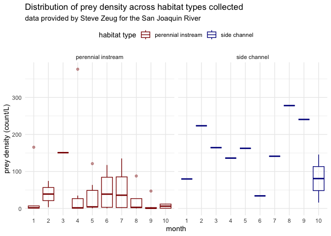
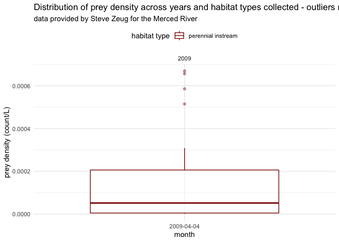

Steve Zeug Data
================
Maddee Rubenson (FlowWest)
2023-01-11

## Zeug Data Standardization

**Datasets provided:**

- Merced River:
  - `Flow_meter_Drift.xlsx`

  - `Merced invert data_environment.xls`

  - `salmon data_final(Josie).xlsx`

  - `Temperature.xlsx`
- San Joaquin River
  - `summary_zooplankton_10_19_17.xlsx`

**Author contact info:**

Steve Zeug \[stevez@fishsciences.net\]

## Prey Data

### San Joaquin River Dataset:

Final prey density for the San Joaquin River dataset provided by Zeug
includes the following variables:

- `year`: calendar year data was collected

- `week`: week data was collected

- `gear_type`: the type of gear used to collect zooplankton.

- `species`: species of zooplankton

- `prey_density`: density of zooplankton (count/L)

- `size_class`: size class of zooplankton, determined by mesh size

- `mesh_size`: mesh size of net used to collect zooplankton

- `habitat_type`: habitat type of location where zooplankton were
  collected

- `lat`: latitude of sampling location

- `lon`: longitude of sampling location

- `site`: location description

- `author`: author of dataset

- `watershed`: unique watershed name associated with collected data

#### Raw data

``` r
zeug_prey_data_raw <- readxl::read_excel('data-raw/zeug/san_joaquin/summary_zooplankton_10_19_17.xlsx', sheet = "CountLiter2016", range = "A1:H56") |> glimpse()
```

    ## Rows: 55
    ## Columns: 8
    ## $ Year            <dbl> 2016, 2016, 2016, 2016, 2016, 2016, 2016, 2016, 2016, …
    ## $ Week            <dbl> 1, 1, 2, 4, 4, 5, 5, 6, 7, 8, 9, 9, 10, 10, 1, 1, 4, 4…
    ## $ Reach           <chr> "1A", "1A", "1A", "1A", "1A", "1A", "1A", "1A", "1A", …
    ## $ TaxGrp_1        <chr> "Microcrustacea", "Insecta-Diptera", "Microcrustacea",…
    ## $ TotalTaxbyReach <dbl> 559, 136, 35, 2568, 141, 1939, 106, 5169, 2702, 3926, …
    ## $ ConcReachWeek   <chr> "1A-1", "1A-1", "1A-2", "1A-4", "1A-4", "1A-5", "1A-5"…
    ## $ `Sum of Volume` <dbl> 80.00, 80.00, 10.00, 73.75, 73.75, 30.50, 30.50, 70.50…
    ## $ CountperVolume  <dbl> 6.9875000, 1.7000000, 3.5000000, 34.8203390, 1.9118644…

#### Standard format

**excluded variables:**

**notes:**

- column `CountPerVolume` was used for `prey_density` and determined to
  have units of total prey/liter and kept as such

- since we do not have sampling dates, I kept in `Year` and `Week`. We
  might want to remove these for the full standardized dataset.

- added lat/longs provided by Steve Zeug

- manually assigned `habitat_types` based on best professional judgement
  (see map below for verification)

``` r
zeug_prey_data_san_joaquin <- zeug_prey_data_raw %>%
  rename(sample_id = Reach, 
         species = TaxGrp_1,
         count = TotalTaxbyReach,
         prey_density = CountperVolume) %>%# currently total prey/l
  select(sample_id, species, prey_density, Year, Week) %>% 
  mutate(author = "Zeug",
         watershed = 'San Joaquin',
         site = sample_id,
         size_class = "micro",
         species = tolower(species),
         gear_type = "10 liter Schindler-Patalas",
         mesh_size = 64) %>%
  select(-sample_id) |> 
  rename(week = Week, 
         year = Year)
```

##### Locations Standard Format

**variables removed**

**notes:**

``` r
sj_locations <- data.frame(
  site = c('1A', '2A', '4B-CS', '4B-ESB'),
  habitat_type = c('perennial instream', 'perennial instream', 'side channel',  'perennial instream'),
  lat = c(36.860461, 36.798219, 37.166257, 37.166817),
  lon = c(-119.847043, -120.16085, -120.619793, -120.631145)
)
```

##### Combine prey data with locations

This produces the final prey density dataset.

``` r
zeug_prey_data_san_joaquin_final <- zeug_prey_data_san_joaquin |> 
  left_join(sj_locations) 

kable(head(zeug_prey_data_san_joaquin_final, 5))
```

| species         | prey_density | year | week | author | watershed   | site | size_class | gear_type                  | mesh_size | habitat_type       |      lat |      lon |
|:----------------|-------------:|-----:|-----:|:-------|:------------|:-----|:-----------|:---------------------------|----------:|:-------------------|---------:|---------:|
| microcrustacea  |     6.987500 | 2016 |    1 | Zeug   | San Joaquin | 1A   | micro      | 10 liter Schindler-Patalas |        64 | perennial instream | 36.86046 | -119.847 |
| insecta-diptera |     1.700000 | 2016 |    1 | Zeug   | San Joaquin | 1A   | micro      | 10 liter Schindler-Patalas |        64 | perennial instream | 36.86046 | -119.847 |
| microcrustacea  |     3.500000 | 2016 |    2 | Zeug   | San Joaquin | 1A   | micro      | 10 liter Schindler-Patalas |        64 | perennial instream | 36.86046 | -119.847 |
| microcrustacea  |    34.820339 | 2016 |    4 | Zeug   | San Joaquin | 1A   | micro      | 10 liter Schindler-Patalas |        64 | perennial instream | 36.86046 | -119.847 |
| insecta-diptera |     1.911864 | 2016 |    4 | Zeug   | San Joaquin | 1A   | micro      | 10 liter Schindler-Patalas |        64 | perennial instream | 36.86046 | -119.847 |

#### QC

**Notes:**

``` r
summary(zeug_prey_data_san_joaquin_final)
```

    ##    species           prey_density          year           week       
    ##  Length:55          Min.   :  0.184   Min.   :2016   Min.   : 1.000  
    ##  Class :character   1st Qu.:  1.263   1st Qu.:2016   1st Qu.: 4.000  
    ##  Mode  :character   Median :  6.987   Median :2016   Median : 6.000  
    ##                     Mean   : 58.886   Mean   :2016   Mean   : 5.927  
    ##                     3rd Qu.:102.596   3rd Qu.:2016   3rd Qu.: 8.500  
    ##                     Max.   :376.250   Max.   :2016   Max.   :10.000  
    ##     author           watershed             site            size_class       
    ##  Length:55          Length:55          Length:55          Length:55         
    ##  Class :character   Class :character   Class :character   Class :character  
    ##  Mode  :character   Mode  :character   Mode  :character   Mode  :character  
    ##                                                                             
    ##                                                                             
    ##                                                                             
    ##   gear_type           mesh_size  habitat_type            lat       
    ##  Length:55          Min.   :64   Length:55          Min.   :36.80  
    ##  Class :character   1st Qu.:64   Class :character   1st Qu.:36.80  
    ##  Mode  :character   Median :64   Mode  :character   Median :36.86  
    ##                     Mean   :64                      Mean   :36.95  
    ##                     3rd Qu.:64                      3rd Qu.:37.17  
    ##                     Max.   :64                      Max.   :37.17  
    ##       lon        
    ##  Min.   :-120.6  
    ##  1st Qu.:-120.6  
    ##  Median :-120.2  
    ##  Mean   :-120.2  
    ##  3rd Qu.:-120.0  
    ##  Max.   :-119.8

#### Data exploration

``` r
ggplot(zeug_prey_data_san_joaquin_final, aes(x = as.factor(week), y = prey_density)) + 
  geom_boxplot(aes(color = habitat_type), alpha = 0.4) + 
  facet_grid(~habitat_type) + 
  xlab('month') +
  ylab('prey density (count/L)') + 
  ggtitle('Distribution of prey density across habitat types collected', 
          subtitle = "data provided by Steve Zeug for the San Joaquin River") +
  scale_color_manual('habitat type', values=c('darkred', 'darkblue')) + 
  theme(legend.position = "top")
```

<!-- -->

#### Save final dataset

``` r
#save(zeug_prey_data_san_joaquin_final, file = "../../data/zeug_sanJoaquin_prey_data.rda")

zeug_sanJoaquin_prey_data <- zeug_prey_data_san_joaquin_final
usethis::use_data(zeug_sanJoaquin_prey_data, overwrite = TRUE)
```

### Merced River Dataset:

Final prey density for the Merced River dataset provided by Zeug
includes the following variables:

- `date` : date data was collected

- `gear_type`: the type of gear used to collect zooplankton.

- `prey_density`: density of zooplankton (count/L)

- `size_class`: size class of zooplankton, determined by mesh size

- `mesh_size`: mesh size of net used to collect zooplankton

- `habitat_type`: habitat type of location where zooplankton were
  collected

- `site`: location description

- `author`: author of dataset

- `watershed`: unique watershed name associated with collected data

#### Raw data

``` r
zeug_merced_prey_data_raw <- readxl::read_excel('data-raw/zeug/merced/Merced invert data_environment.xls', .name_repair = 'minimal', sheet = "erin_modified",  col_names = FALSE)

dates <- janitor::excel_numeric_to_date(as.numeric(zeug_merced_prey_data_raw[1,3:ncol(zeug_merced_prey_data_raw)]), date_system = 'mac pre-2011') %>% as.character()

sites <- zeug_merced_prey_data_raw[2, 3:ncol(zeug_merced_prey_data_raw)]

col_names <- append(
  c('Species', 'Measurement'),
  paste(dates, sites, sep = '__')
)

names(zeug_merced_prey_data_raw) <- col_names

# view subset of data
zeug_merced_prey_data_raw |> glimpse()
```

    ## Rows: 284
    ## Columns: 14
    ## $ Species                      <chr> NA, NA, NA, NA, "Mayfly Adult", NA, NA, N…
    ## $ Measurement                  <chr> "Date", "Site", "Subs", "Mfactor", "No. s…
    ## $ `2009-04-04__21 Drift`       <chr> "38445", "21 Drift", "1", "30", "12", "0"…
    ## $ `2009-04-04__21 Benthic #1`  <chr> "38445", "21 Benthic #1", "2", "15", "0",…
    ## $ `2009-04-04__21 Benthic #2`  <chr> "38445", "21 Benthic #2", "1", "30", "0",…
    ## $ `2009-04-04__UN4 Benthic #2` <chr> "38445", "UN4 Benthic #2", "1", "30", "0"…
    ## $ `2009-04-04__Drift UN4`      <chr> "38445", "Drift UN4", "1", "30", "4", "0"…
    ## $ `2009-04-04__Drift 6`        <chr> "38445", "Drift 6", "1", "30", "18", "0",…
    ## $ `2009-04-04__Drift UN1`      <chr> "38445", "Drift UN1", "1", "30", "1", "0"…
    ## $ `2009-04-09__6 Benthic #1`   <chr> "38450", "6 Benthic #1", "2", "15", "8", …
    ## $ `2009-04-09__6 Benthic #2`   <chr> "38450", "6 Benthic #2", "1", "30", "0", …
    ## $ `2009-04-09__UN4 Benthic #1` <chr> "38450", "UN4 Benthic #1", "1", "30", "0"…
    ## $ `2009-04-04__UN1 Benthic #1` <chr> "38445", "UN1 Benthic #1", "2", "15", "0"…
    ## $ `2009-04-09__UN1 Benthic #2` <chr> "38450", "UN1 Benthic #2", "2", "15", "0"…

#### Standard format

**excluded variables:**

**notes:**

- `gear_type` was extracted from column name

- TODO: check units for prey density. Currently using No. m-2 (subsam)
  and dividing by provided volume (m^3) and converting to count/L.

- TODO: do not have location data for Merced sites

``` r
zeug_merced_prey_data <- zeug_merced_prey_data_raw[3:nrow(zeug_merced_prey_data_raw),] %>%
  fill(Species, .direction = 'down') %>% #TODO make sure species is accurate(looks like fill is tricky with xlsx format)
  filter(Measurement == 'No. m-2 (subsam)') %>% # is this the value we want for prey density??
  pivot_longer(cols = !c('Species', 'Measurement'), names_to = "date__site") %>%
  separate(col = date__site, into = c('date', 'site'), sep = '__') %>%
  rename(prey_density = value, #TODO: what is this unit, No. m-2 (subsam) ??
        date = date,
         sample_id = site,
         species = Species) %>%
  mutate(author = 'Zeug',
         life_stage = ifelse(grepl('Adult', species), 'Adult',
                             ifelse(grepl('Larvae', species), 'Larvae',
                                    ifelse(grepl('Pupae', species), 'Pupae',
                                           ifelse(grepl('Nymph', species), 'Nymph', NA)))),
         gear_type = ifelse(grepl('Drift', sample_id), 'Drift',
                            ifelse(grepl('Benthic', sample_id), 'Benthic', NA))) %>%
  mutate(tmp_name = gsub('Drift', '', sample_id), # extract sample_id
         name = stringr::str_split(tmp_name, " ") %>% map_chr(., 1),
         sample_id = ifelse(name == '', tmp_name, name ),
         size_class = "macro",
         watershed = "Merced",
         gear_type = tolower(gear_type),
         life_stage = tolower(life_stage),
         species = tolower(species),
         habitat_type = "perennial instream") %>%
  select(-c(tmp_name, name)) %>%
  mutate(sample_id = gdata::trim(sample_id),
         mesh_size = 500) %>%
  filter(gear_type == "drift") %>%
  mutate(gear_type = "net throw") 

# Load in volumes sampled from separate xlsx sheet and use it to calculated count/L 
vols <- readxl::read_excel('data-raw/zeug/merced/Flow_meter_Drift.xlsx', skip = 4) %>%
  janitor::clean_names()

vols <- vols %>% select(site, corrected_voume_m3_s_1) %>%
  filter(!is.na(corrected_voume_m3_s_1)) |> 
  rename(sample_id = site)

zeug_merced_prey_data_final <- zeug_merced_prey_data |> 
  left_join(vols) |> 
  mutate(prey_density = as.numeric(prey_density)/corrected_voume_m3_s_1/1000, # convert from m^3 to L
         date = as.Date(date)) %>%
  rename(site = sample_id) %>%
  select(-corrected_voume_m3_s_1, -Measurement)

kable(head(zeug_merced_prey_data_final, 5))
```

| species            | date       | site | prey_density | author | life_stage | gear_type | size_class | watershed | habitat_type       | mesh_size |
|:-------------------|:-----------|:-----|-------------:|:-------|:-----------|:----------|:-----------|:----------|:-------------------|----------:|
| mayfly adult       | 2009-04-04 | 21   |    0.0009849 | Zeug   | adult      | net throw | macro      | Merced    | perennial instream |       500 |
| mayfly adult       | 2009-04-04 | UN4  |    0.0002928 | Zeug   | adult      | net throw | macro      | Merced    | perennial instream |       500 |
| mayfly adult       | 2009-04-04 | 6    |    0.0008540 | Zeug   | adult      | net throw | macro      | Merced    | perennial instream |       500 |
| mayfly adult       | 2009-04-04 | UN1  |    0.0000515 | Zeug   | adult      | net throw | macro      | Merced    | perennial instream |       500 |
| chironomidae adult | 2009-04-04 | 21   |    0.0060738 | Zeug   | adult      | net throw | macro      | Merced    | perennial instream |       500 |

##### Locations Standard Format

There is no location data available for the Merced data provided by
Zeug.

#### QC

**Notes:**

- All data was collected on 2009-04-04

``` r
summary(zeug_merced_prey_data_final)
```

    ##    species               date                site          
    ##  Length:140         Min.   :2009-04-04   Length:140        
    ##  Class :character   1st Qu.:2009-04-04   Class :character  
    ##  Mode  :character   Median :2009-04-04   Mode  :character  
    ##                     Mean   :2009-04-04                     
    ##                     3rd Qu.:2009-04-04                     
    ##                     Max.   :2009-04-04                     
    ##   prey_density           author           life_stage         gear_type        
    ##  Min.   :0.00000000   Length:140         Length:140         Length:140        
    ##  1st Qu.:0.00000000   Class :character   Class :character   Class :character  
    ##  Median :0.00000000   Mode  :character   Mode  :character   Mode  :character  
    ##  Mean   :0.00026269                                                           
    ##  3rd Qu.:0.00004744                                                           
    ##  Max.   :0.00607376                                                           
    ##   size_class         watershed         habitat_type         mesh_size  
    ##  Length:140         Length:140         Length:140         Min.   :500  
    ##  Class :character   Class :character   Class :character   1st Qu.:500  
    ##  Mode  :character   Mode  :character   Mode  :character   Median :500  
    ##                                                           Mean   :500  
    ##                                                           3rd Qu.:500  
    ##                                                           Max.   :500

#### Data exploration

``` r
zeug_merced_prey_data_final |> 
  filter(prey_density > 0 ) |> 
  filter(prey_density <= 0.000807821 ) |> 
ggplot(aes(x = as.factor((date)), y = prey_density)) + 
  geom_boxplot(aes(color = habitat_type), alpha = 0.4) + 
  facet_grid(~year(date)) + 
  xlab('month') +
  ylab('prey density (count/L)') + 
  ggtitle('Distribution of prey density across years and habitat types collected - outliers removed', 
          subtitle = "data provided by Steve Zeug for the Merced River") +
  scale_color_manual('habitat type', values=c('darkred', 'darkblue')) + 
  theme(legend.position = "top")
```

<!-- -->

#### Save final dataset

``` r
#save(zeug_merced_prey_data_final, file = "../../data/zeug_merced_prey_data.rda")

zeug_merced_prey_data <- zeug_merced_prey_data_final
usethis::use_data(zeug_merced_prey_data, overwrite = TRUE)
```

## Upcoming Updates

- include fish weight metrics
- include environmental datasets
