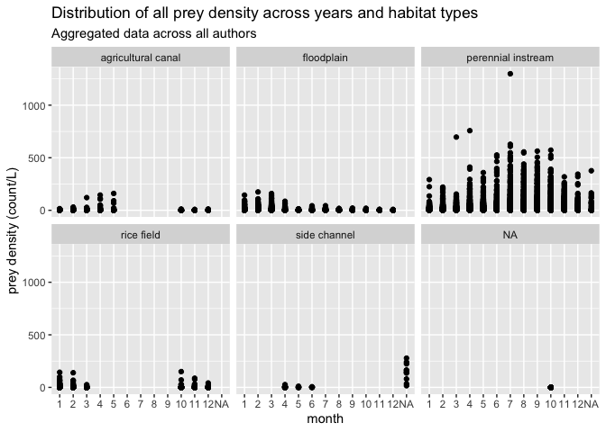
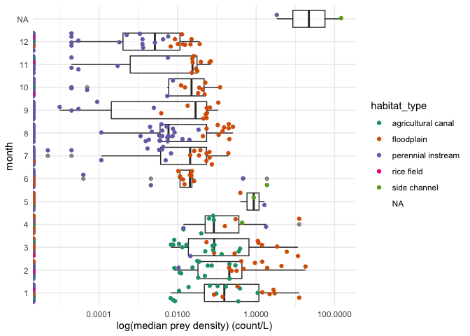
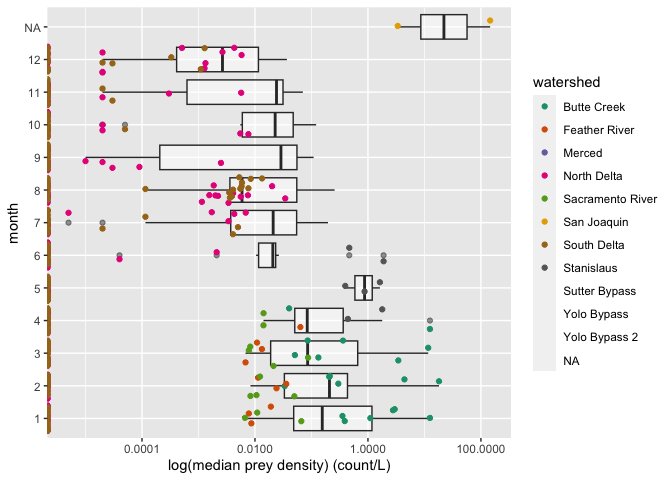
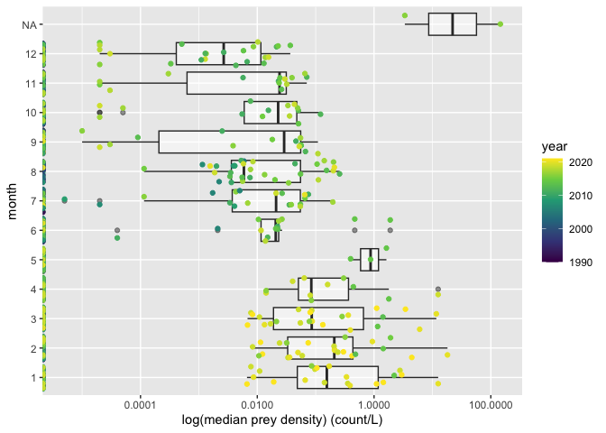

Prey Data Overview
================
Maddee Rubenson (FlowWest)
2022-12-20

## Prey Density

### Aggregate All Prey Data

``` r
all_prey_density <- bind_rows(preyDataProcessing::cordoleani_prey_data,
                      preyDataProcessing::zeug_merced_prey_data, 
                      preyDataProcessing::zeug_sanJoaquin_prey_data, 
                      preyDataProcessing::montgomery_prey_data, 
                      preyDataProcessing::guignard_prey_data, 
                      preyDataProcessing::corline_prey_data,
                      preyDataProcessing::zooper_prey_data) 

# usethis::use_data(all_prey_density, overwrite = TRUE)
```

### Create Monthly Prey Density Dataset

**Notes:**

- There are two NAs associated with the month of San Joaquin data
  because data received was aggregated to year

``` r
# monthly aggregation by watershed,  habitat type -------------------------
## group by watershed, habitat type, year, month - summarize prey density (median, min, max)
monthly_prey_density <- all_prey_density %>%
  mutate(year = ifelse(!is.na(date), lubridate::year(date), 2016),
         month = lubridate::month(date)) %>%
  group_by(watershed, habitat_type, year, month) %>%
  summarise_at(vars(prey_density), .funs = c('min', 'max', 'median', 'var'), na.rm = TRUE) %>%
  ungroup() %>%
  rename(min_prey_density = min,
         max_prey_density = max,
         median_prey_density = median,
         var_prey_density = var) |> glimpse()
```

    ## Rows: 915
    ## Columns: 8
    ## $ watershed           <chr> "Butte Creek", "Butte Creek", "Butte Creek", "Butte Creek", "Butte Creek", "Butte Creek", "Butte Creek", "Butte Cr…
    ## $ habitat_type        <chr> "agricultural canal", "agricultural canal", "agricultural canal", "agricultural canal", "agricultural canal", "agr…
    ## $ year                <dbl> 2019, 2019, 2019, 2019, 2020, 2020, 2020, 2021, 2021, 2021, 2019, 2019, 2019, 2019, 2020, 2020, 2020, 2021, 2021, …
    ## $ month               <dbl> 1, 2, 3, 4, 1, 2, 3, 1, 2, 3, 1, 2, 3, 4, 1, 2, 3, 1, 2, 3, 1, 2, 3, 4, 1, 2, 3, 1, 2, 3, 4, 10, 11, 4, 5, 6, 7, 8…
    ## $ min_prey_density    <dbl> 0.0058946275, 0.0014147106, 0.0022104853, 0.0058946275, 0.0092847019, 0.0261132240, 0.0104081178, 0.0186681772, 0.…
    ## $ max_prey_density    <dbl> 2.970892271, 1.155346994, 3.713615339, 2.481638187, 0.956324294, 6.518059051, 10.639057310, 5.763832997, 11.353052…
    ## $ median_prey_density <dbl> 0.353677651, 0.033599377, 0.050929582, 0.040279955, 0.388324882, 0.210577039, 0.361827661, 1.101422454, 0.29894525…
    ## $ var_prey_density    <dbl> 0.4564077656182, 0.0944235745281, 0.9118003674302, 0.6375710768101, 0.1215640815584, 3.1044130469641, 7.9399227344…

``` r
# save file for use in R package
# usethis::use_data(monthly_prey_density)
```

<!-- ## Fish Data  -->
<!-- ```{r} -->
<!-- load('../data/all_fish_data.rda') -->
<!-- #all_fish_data <- all_fish_data %>% select(-lat, -lon) -->
<!-- #usethis::use_data(all_fish_data, overwrite = TRUE) -->
<!-- monthly_fish_data <- all_fish_data %>% -->
<!--   mutate(year = ifelse(!is.na(date), lubridate::year(date), 2016), -->
<!--          month = lubridate::month(date)) %>% -->
<!--   mutate(habitat_type = case_when(watershed == "Merced" ~ "perennial instream", -->
<!--                                   watershed != "Merced" ~ habitat_type)) %>% -->
<!--   group_by(watershed, habitat_type, year, month) %>% -->
<!--   summarise_at(vars(mass, fork_length), .funs = c('min', 'max', 'median'), na.rm = TRUE) %>% -->
<!--   ungroup() |> glimpse() -->
<!-- # save file for use in R package -->
<!-- # usethis::use_data(monthly_fish_data) -->
<!-- ``` -->
<!-- ## Environmental Data  -->
<!-- ```{r} -->
<!-- all_enviro <- preyDataProcessing::all_enviro_data %>% glimpse -->
<!-- ``` -->

# Explore Variables

## Authors

``` r
prey_agg_by_author <- preyDataProcessing::all_prey_density %>%
  group_by(author) %>%
  summarise_at(vars(prey_density), .funs = c('min', 'max', 'median', 'var'), na.rm = TRUE)

kable(prey_agg_by_author, digits = 1, caption = "summary statistics of prey density values across authors included in the prey data package")
```

| author       | min |    max | median |    var |
|:-------------|----:|-------:|-------:|-------:|
| Cordoleani   |   0 |  174.6 |    0.1 |  117.5 |
| Corline      |   0 |  108.5 |    0.6 |   80.3 |
| Guignard     |   0 |   26.7 |    0.8 |   15.2 |
| Montgomery   |   0 |  160.3 |    0.0 |    8.7 |
| Zeug         |   0 |  376.2 |    0.0 | 2693.0 |
| zooper: 20mm |   0 |  757.6 |    0.0 |    8.3 |
| zooper: EMP  |   0 | 1298.8 |    0.0 |  106.4 |
| zooper: FMWT |   0 |   47.5 |    0.0 |    2.7 |
| zooper: FRP  |   0 |  239.3 |    0.0 |   17.8 |
| zooper: STN  |   0 |  147.3 |    0.1 |   15.0 |

summary statistics of prey density values across authors included in the
prey data package

## Habitat Type

Habitat types included in the prey data package include:

- Agricultural canal
- Floodplain
- Perennial instream
- Side channel

Many habitat types were assigned based on the sampling locations
provided by authors.

``` r
ggplot(all_prey_density, aes(x = as.factor(month(date)), y = prey_density)) + 
  geom_point() + 
  facet_wrap(~habitat_type) + 
  xlab('month') +
  ylab('prey density (count/L)') + 
  ggtitle('Distribution of all prey density across years and habitat types', 
          subtitle = "Aggregated data across all authors") 
```

<!-- -->

``` r
ggplot() +
  geom_boxplot(data = monthly_prey_density, aes(x = as.factor(month), y = median_prey_density), alpha = 0.5) +
  geom_jitter(data = monthly_prey_density, aes(x = as.factor(month), y = median_prey_density, color = habitat_type)) +
  scale_y_continuous(trans='log10') +
  xlab('month') +
  ylab('log(median prey density) (count/L)') +
  scale_color_brewer(palette = 'Dark2') +
  coord_flip() +
  theme_minimal()
```

<!-- -->

``` r
preyDataProcessing::all_prey_density %>%
  group_by(habitat_type) %>%
  summarise(author = paste0(unique(author), collapse = ", ")) %>% kable()
```

| habitat_type       | author                                                                                                 |
|:-------------------|:-------------------------------------------------------------------------------------------------------|
| agricultural canal | Cordoleani, Montgomery, Corline                                                                        |
| floodplain         | Cordoleani, Montgomery, Guignard, Corline, zooper: FMWT, zooper: FRP, zooper: STN, zooper: 20mm        |
| perennial instream | Zeug, Montgomery, Guignard, Corline, zooper: EMP, zooper: FMWT, zooper: FRP, zooper: STN, zooper: 20mm |
| rice field         | Montgomery                                                                                             |
| side channel       | Zeug, Guignard                                                                                         |
| NA                 | Montgomery                                                                                             |

``` r
all_prey_density %>%
  group_by(habitat_type, author) %>%
  select(prey_density) %>%
  summarise_if(is.numeric, .funs = c("mean", "min", "max", "var"), na.rm = TRUE) %>% 
  kable(digits=1, format.args = list(big.mark = ","))
```

| habitat_type       | author       |  mean |  min |     max |     var |
|:-------------------|:-------------|------:|-----:|--------:|--------:|
| agricultural canal | Cordoleani   |   0.5 |  0.0 |   120.7 |     8.9 |
| agricultural canal | Corline      |   0.3 |  0.0 |     5.4 |     0.6 |
| agricultural canal | Montgomery   |   0.5 |  0.0 |   160.3 |    25.8 |
| floodplain         | Cordoleani   |  10.1 |  0.0 |   174.6 |   555.5 |
| floodplain         | Corline      |   3.9 |  0.0 |   108.5 |    87.4 |
| floodplain         | Guignard     |   1.0 |  0.0 |     5.3 |     1.7 |
| floodplain         | Montgomery   |   0.3 |  0.0 |    67.9 |     5.3 |
| floodplain         | zooper: 20mm |   0.2 |  0.0 |    14.3 |     0.8 |
| floodplain         | zooper: FMWT |   0.5 |  0.0 |    20.7 |     1.8 |
| floodplain         | zooper: FRP  |   0.2 |  0.0 |    11.3 |     0.8 |
| floodplain         | zooper: STN  |   1.1 |  0.0 |    43.9 |     6.5 |
| perennial instream | Corline      |   0.0 |  0.0 |     0.3 |     0.0 |
| perennial instream | Guignard     |   3.7 |  0.0 |    23.1 |    26.7 |
| perennial instream | Montgomery   |   0.1 |  0.0 |   104.3 |     1.2 |
| perennial instream | Zeug         |   8.8 |  0.0 |   376.2 | 1,399.6 |
| perennial instream | zooper: 20mm |   0.3 |  0.0 |   757.6 |     8.5 |
| perennial instream | zooper: EMP  |   0.9 |  0.0 | 1,298.8 |   106.4 |
| perennial instream | zooper: FMWT |   0.4 |  0.0 |    47.5 |     2.9 |
| perennial instream | zooper: FRP  |   0.4 |  0.0 |   239.3 |    20.1 |
| perennial instream | zooper: STN  |   1.0 |  0.0 |   147.3 |    16.1 |
| rice field         | Montgomery   |   1.0 |  0.0 |   150.0 |    50.2 |
| side channel       | Guignard     |   2.5 |  0.0 |    26.7 |    18.6 |
| side channel       | Zeug         | 147.4 | 15.9 |   278.0 | 6,690.6 |
| NA                 | Montgomery   |   0.0 |  0.0 |     0.0 |     0.0 |

## Watersheds

There are 12 watersheds included in the monthly prey density data,
including:

- Butte Creek
- Feather River
- Merced
- North Delta
- Sacramento River
- San Joaquin River
- South Delta
- Stanislaus
- Sutter Bypass
- Yolo Bypass
- Yolo Bypass 2 \#TODO: aggregate Yolo and Yolo Bypass 2

``` r
ggplot() +
  geom_boxplot(data = monthly_prey_density, aes(x = as.factor(month), y = median_prey_density), alpha = 0.5) +
  geom_jitter(data = monthly_prey_density, aes(x = as.factor(month), y = median_prey_density, color = watershed)) +
  scale_y_continuous(trans='log10') +
  ylab('log(median prey density) (count/L)') +
  xlab('month') +
  #facet_wrap(~watershed)+
  scale_color_brewer(palette = 'Dark2')+
  coord_flip()
```

<!-- -->

## Temporal Variation

``` r
ggplot() +
  geom_boxplot(data = monthly_prey_density, aes(x = as.factor(month), y = median_prey_density), alpha = 0.5) +
  geom_jitter(data = monthly_prey_density, aes(x = as.factor(month), y = median_prey_density, color = year)) +
  scale_colour_continuous(type = 'viridis')+
  scale_y_continuous(trans='log10') +
  ylab('log(median prey density) (count/L)') +
  xlab('month') +
  coord_flip()
```

<!-- -->

<!-- ## Fish Data -->
<!-- ```{r} -->
<!-- # mass -->
<!-- ggplot() + -->
<!--   geom_boxplot(data = monthly_fish_data, aes(x = as.factor(month), y = mass_median), alpha = 0.5) + -->
<!--   geom_jitter(data = monthly_fish_data, aes(x = as.factor(month), y = mass_median, color = habitat_type)) + -->
<!--   ylab('mass (grams)') + -->
<!--   xlab('month') + -->
<!--   scale_color_brewer(palette = 'Dark2')+ -->
<!--   coord_flip() -->
<!-- # fork length (mm) -->
<!-- ggplot() + -->
<!--   geom_boxplot(data = monthly_fish_data, aes(x = as.factor(month), y = fork_length_median), alpha = 0.5) + -->
<!--   geom_jitter(data = monthly_fish_data, aes(x = as.factor(month), y = fork_length_median, color = habitat_type)) + -->
<!--   ylab('fork length (mm)') + -->
<!--   xlab('month') + -->
<!--   scale_color_brewer(palette = 'Dark2')+ -->
<!--   coord_flip() -->
<!-- ``` -->
<!-- ## Environmental Data  -->
<!-- * Not aggregated by month -->
<!-- * Includes: dissolved oxygen, temperature and flow  -->
<!-- ```{r} -->
<!-- # temperature -->
<!-- all_enviro %>% filter(!is.na(temperature)) %>% -->
<!--   ggplot() + -->
<!--   geom_line(aes(x = date, y  = temperature)) +  -->
<!--   facet_wrap(~ author) + -->
<!--   ylab('temperature (celcius)') -->
<!-- # dissolved oxygen -->
<!-- all_enviro %>% filter(!is.na(do_mg_l)) %>% -->
<!--   ggplot() + -->
<!--   geom_line(aes(x = date, y  = do_mg_l)) +  -->
<!--   facet_wrap(~ author) + -->
<!--   ylab('dissolved oxygen (mg/l)') -->
<!-- # flow -->
<!-- all_enviro %>% filter(!is.na(flow_cfs)) %>% -->
<!--   ggplot() + -->
<!--   geom_line(aes(x = date, y  = flow_cfs)) +  -->
<!--   facet_wrap(~ author) + -->
<!--   ylab('flow_cfs') -->
<!-- ``` -->
