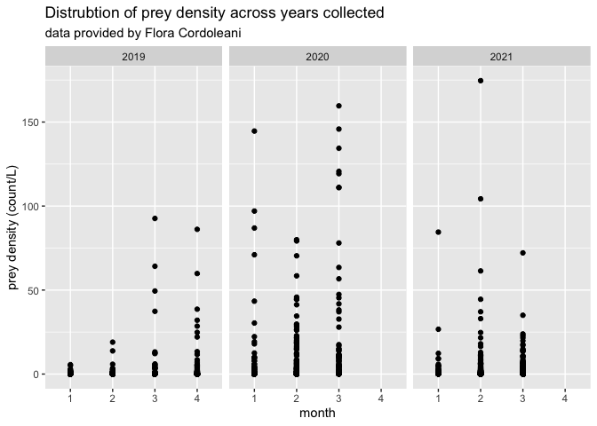

Flora Cordoleani Data
================
Maddee Rubenson (FlowWest)
2022-12-20

## Cordoleani Data Standardization

**Datasets provided:**

- `cage_locations.csv`
- `cagesalmon_growth.csv`
- `dailycagefish_data_2019.csv`
- `dailycagefish_data_2020.csv`
- `doboall.csv`
- `tidy_zoop_density.csv`

**Author contact info:**

Flora Cordoleani
\[[flora.cordoleani@noaa.gov](flora.cordolean@noaa.gov)\]

### Prey Data

Final prey density dataset includes the following variables:

- `date`: YYYY-MM-DD
- `gear_type`: the type of gear used to collect zooplankton.
- `species`: species of zooplankton
- `prey_density`: density of zooplankton (count/L)
- `size_class`: size class of zooplankton, determined by mesh size
- `mesh_size`: mesh size of net used to collect zooplankton
- `habitat_type`: habitat type of location where zooplankton were
  collected
- `lat`: latitude of sampling location
- `lon`: longitude of sampling location
- `site`: location description
- `author`: author of dataset
- `watershed`: unique watershed name associated with collected data

#### Raw data

``` r
path <- system.file("extdata", "cordoleani", "tidy_zoop_density.csv", package = "preyDataProcessing")
cordo_prey_raw <- read_csv(path) |> glimpse()
#> Rows: 2,636
#> Columns: 7
#> $ year         <dbl> 2019, 2019, 2019, 2019, 2019, 2019, 2019, 2019, 2019, 2019, 2019, 2019, 2019, 2019, 2019, 2019, 2019, 2019, 2019, 2019, 2…
#> $ report_id    <chr> "BSC1", "BSC1", "BSC1", "BSC1", "BSC1", "BSC1", "BSC1", "BSC1", "FRC1", "FRC1", "FRC1", "FRC1", "FRC1", "FRC1", "FRC1", "…
#> $ habitat_type <chr> "Canal channel", "Canal channel", "Canal channel", "Canal channel", "Canal channel", "Canal channel", "Canal channel", "C…
#> $ region       <chr> "Butte Sink", "Butte Sink", "Butte Sink", "Butte Sink", "Butte Sink", "Butte Sink", "Butte Sink", "Butte Sink", "Feather …
#> $ sample_date  <chr> "1/7/2019", "1/7/2019", "1/7/2019", "1/7/2019", "1/7/2019", "1/7/2019", "1/7/2019", "1/7/2019", "1/7/2019", "1/7/2019", "…
#> $ taxa         <chr> "Aquatic insect", "Copepoda", "Large cladocera", "Ostracoda", "Rare", "Rotifera", "Small cladocera", "Terrestrial insect"…
#> $ value        <dbl> 127.3239545, 650.7668784, 756.8701738, 7.0735530, 183.9123787, 113.1768484, 353.6776513, 28.2942121, 16.9765273, 26.17214…
```

#### Standard format

**excluded variables:**

- removed temperature to include in a standalone dataset that can be
  mapped to this dataset using `sample_id` and `date`

**notes:**

- chose to not use interpolated or filled values for prey density

- Defined `sample_id` as `cage_id`

- Defined `species` as `taxa`

- mapped `Canal channel` and `Agriculture` to `agricultural canal`

- mapped `Channel` and `River Channel` to `perennial instream`

- mapped `Wetland` to `floodplain`

- Changed units for `prey_density` from count/m^3 to count/L

``` r
cordoleani_zoop <- cordo_prey_raw %>% 
  rename(prey_density = value, # units are organisms/m^3 per Sutter 2020 report 
         sample_id = report_id,
         date = sample_date,
         location = region,
         species = taxa) %>%
  mutate(date = mdy(date),
         prey_density = prey_density/1000, # 1 m^3 = 1000 Liters 
         author = 'Cordoleani',
         habitat_type = ifelse(habitat_type == "Agriculture", 'agricultural canal',
                               ifelse(habitat_type == 'Channel', 'perennial instream',
                                      ifelse(habitat_type == "River Channel", 'perennial instream',
                                             ifelse(habitat_type == 'Wetland', 'floodplain', 'agricultural canal' )))),
         watershed = case_when(location == "Butte Sink" ~ "Butte Creek", 
                            location == "Sacramento River" ~ "Sacramento River", 
                            location == "Feather River" ~ "Feather River", 
                            location %in% c("Lower Bypass", "Upper Bypass") ~ 
                              "Sutter Bypass"), 
         site = paste0(location, "-", sample_id),
         size_class = "meso",
         gear_type = "net throw",
         mesh_size = 150,
         species = tolower(species)) %>% 
         select(-location, -sample_id, -year) 
```

##### Locations Standard Format

**variables removed**

**notes:**

``` r
path <- system.file("extdata", "cordoleani", "Cage_Locations.csv", package = "preyDataProcessing")
cordoleani_locations_raw <- read_csv(path) 

cordoleani_locations <- cordoleani_locations_raw %>%
  rename(location = Region, 
         sample_id = Report_ID, 
         habitat_type = Type, 
         lon = long) %>%
  select(-Name,  -Report_type) %>%
  mutate(habitat_type = ifelse(habitat_type == "Agriculture", 'agricultural canal',
                               ifelse(habitat_type == 'Channel', 'perennial instream',
                                      ifelse(habitat_type == "River Channel", 'perennial instream',
                                             ifelse(habitat_type == 'Wetland', 'floodplain', 'agricultural canal' ))))) %>%
  mutate(site = paste0(location, "-", sample_id)) %>%
  mutate(site_for_fish = paste0(location, "-", Site)) %>%
  select(-location, -sample_id, -habitat_type) %>%
  glimpse()
#> Rows: 20
#> Columns: 5
#> $ Site          <chr> "BSSS", "BSMR", "BCGR", "BSLR", "BCLC", "BCMP", "SBBF", "SBFR", "SBSNWR", "SBSNWRC", "SBKR", "SBWS", "SBWSC", "SBLF", "S…
#> $ lat           <dbl> 39.3481, 39.2858, 39.3607, 39.2350, 39.2398, 39.1900, 39.1445, 39.1277, 39.0988, 39.1027, 38.9180, 38.9026, 38.9018, 38.…
#> $ lon           <dbl> -121.8901, -121.9246, -121.8936, -121.9470, -121.9480, -121.9092, -121.8422, -121.8147, -121.7609, -121.7592, -121.6265,…
#> $ site          <chr> "Butte Sink-BSW1", "Butte Sink-BSW2", "Butte Sink-BSC1", "Butte Sink-BSA1", "Butte Sink-BSC2", "Upper Bypass-UBC1", "Upp…
#> $ site_for_fish <chr> "Butte Sink-BSSS", "Butte Sink-BSMR", "Butte Sink-BCGR", "Butte Sink-BSLR", "Butte Sink-BCLC", "Upper Bypass-BCMP", "Upp…
```

##### Combine prey data with locations

This produces the final prey density dataset.

``` r

cordoleani_zoop_final <- cordoleani_zoop |> 
  left_join(cordoleani_locations) |> 
  select(-site_for_fish, -Site)

kable(head(cordoleani_zoop_final, 5))
```

| habitat_type       | date       | species         | prey_density | author     | watershed   | site            | size_class | gear_type | mesh_size |     lat |       lon |
|:-------------------|:-----------|:----------------|-------------:|:-----------|:------------|:----------------|:-----------|:----------|----------:|--------:|----------:|
| agricultural canal | 2019-01-07 | aquatic insect  |    0.1273240 | Cordoleani | Butte Creek | Butte Sink-BSC1 | meso       | net throw |       150 | 39.3607 | -121.8936 |
| agricultural canal | 2019-01-07 | copepoda        |    0.6507669 | Cordoleani | Butte Creek | Butte Sink-BSC1 | meso       | net throw |       150 | 39.3607 | -121.8936 |
| agricultural canal | 2019-01-07 | large cladocera |    0.7568702 | Cordoleani | Butte Creek | Butte Sink-BSC1 | meso       | net throw |       150 | 39.3607 | -121.8936 |
| agricultural canal | 2019-01-07 | ostracoda       |    0.0070736 | Cordoleani | Butte Creek | Butte Sink-BSC1 | meso       | net throw |       150 | 39.3607 | -121.8936 |
| agricultural canal | 2019-01-07 | rare            |    0.1839124 | Cordoleani | Butte Creek | Butte Sink-BSC1 | meso       | net throw |       150 | 39.3607 | -121.8936 |

#### QC

**Notes:**

``` r
summary(cordoleani_zoop_final)
#>  habitat_type            date              species           prey_density          author           watershed             site          
#>  Length:2779        Min.   :2019-01-07   Length:2779        Min.   :  0.00035   Length:2779        Length:2779        Length:2779       
#>  Class :character   1st Qu.:2019-03-18   Class :character   1st Qu.:  0.01061   Class :character   Class :character   Class :character  
#>  Mode  :character   Median :2020-02-19   Mode  :character   Median :  0.05918   Mode  :character   Mode  :character   Mode  :character  
#>                     Mean   :2020-02-20                      Mean   :  2.20207                                                           
#>                     3rd Qu.:2021-02-08                      3rd Qu.:  0.43588                                                           
#>                     Max.   :2021-03-29                      Max.   :174.62931                                                           
#>                                                                                                                                         
#>   size_class         gear_type           mesh_size        lat             lon        
#>  Length:2779        Length:2779        Min.   :150   Min.   :38.68   Min.   :-122.0  
#>  Class :character   Class :character   1st Qu.:150   1st Qu.:38.81   1st Qu.:-121.9  
#>  Mode  :character   Mode  :character   Median :150   Median :39.10   Median :-121.8  
#>                                        Mean   :150   Mean   :39.03   Mean   :-121.8  
#>                                        3rd Qu.:150   3rd Qu.:39.19   3rd Qu.:-121.6  
#>                                        Max.   :150   Max.   :39.36   Max.   :-121.6  
#>                                                      NA's   :82      NA's   :82
```

#### Data exploration

``` r
ggplot(cordoleani_zoop_final, aes(x = as.factor(month(date)), y = prey_density)) + 
  geom_point() + 
  facet_grid(~year(date)) + 
  xlab('month') +
  ylab('prey density (count/L)') + 
  ggtitle('Distrubtion of prey density across years collected', 
          subtitle = "data provided by Flora Cordoleani") 
```

<!-- -->

``` r

ggplot(cordoleani_zoop_final, aes(x = as.factor(month(date)), y = prey_density)) + 
  geom_point(aes(color = as.factor(year(date)))) + 
  facet_wrap(~habitat_type + year(date)) + 
  xlab('month') +
  ylab('prey density (count/L)') + 
  ggtitle('Distrubtion of prey density across years and habitat types', 
          subtitle = "data provided by Flora Cordoleani") +  
  scale_color_manual('sample year', values=c('darkgreen', 'darkblue', "darkred")) + 
  theme(legend.position = "top")
```

<!-- -->

#### Save final dataset

``` r

#save(cordoleani_zoop_final, file = "../../data/cordoleani_prey_data.rda")

cordoleani_prey_data <- cordoleani_zoop_final
usethis::use_data(cordoleani_prey_data, overwrite = TRUE)
```

### Fish Data

\[data dictionary - overview of what the data looks like\]

#### Raw data

#### Standard format

- excluded variables:

- notes:

#### QC

#### Data exploration

\[data dictionary - overview of what the data looks like\]

#### Raw data

#### Standard format

- excluded variables:

- notes:

#### QC

#### Data exploration

### Environmental Data
