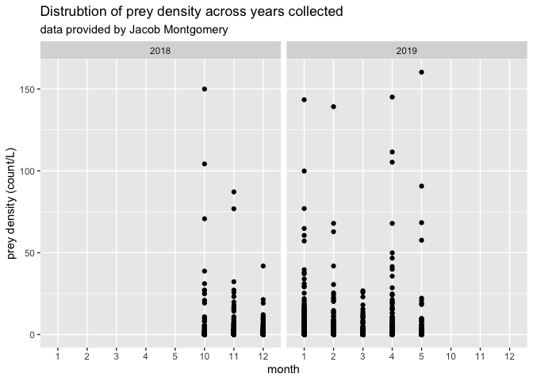
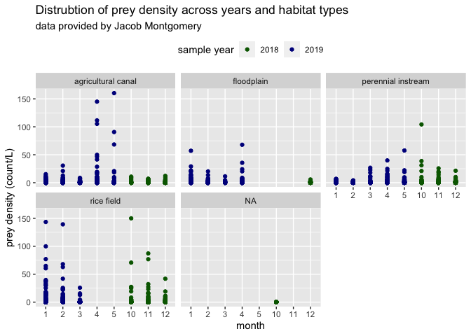

Jacob Montgomery Data
================
Maddee Rubenson (FlowWest)
2022-12-20

## Montgomery Data Standardization

**Datasets provided:**

- [Fish Food on Floodplain Farm Fields 2019 and
  2021](https://portal.edirepository.org/nis/mapbrowse?packageid=edi.996.2)

**Author contact info:**

Jacob Montgomery \[[jacob@caltrout.org](jacob@caltrout.org)\]

### Prey Data

Final prey density dataset includes the following variables:

- `date`: YYYY-MM-DD
- `gear_type`: the type of gear used to collect zooplankton.
- `species`: species of zooplankton
- `life_stage`: lifestage of zooplankton species
- `prey_density`: density of zooplankton (count/L)
- `size_class`: size class of zooplankton, determined by mesh size
- `mesh_size`: mesh size of net used to collect zooplankton
- `habitat_type`: habitat type of location where zooplankton were
  collected
- `lat`: latitude of sampling location
- `lon`: longitude of sampling location
- `site`: location description
- `author`: author of dataset

#### Raw data

``` r
# this a script that sources the EDI data
path <- system.file("extdata", "montgomery", "food_4_fish_data_access.R", package = "preyDataProcessing")
source(path)

montgomery_prey_data |> glimpse()
```

    ## Rows: 638
    ## Columns: 71
    ## $ id                         <chr> "MNT3ASource_10/1/2018_8:00", "MNTNEWCAN_4/8/2019_8:25", "ACCSAC2_11/5/2018_12:30", "ELDCAN_4/8/2019_11:40"…
    ## $ pseudodiptomus_adult       <dbl> 0.000000, 0.000000, 0.000000, 0.000000, 0.000000, 0.000000, 0.000000, 0.000000, 0.000000, 5.658842, 0.00000…
    ## $ psedodiptomus_copepidite   <dbl> 0.000000, 11.317685, 14.634937, 0.000000, 0.000000, 22.635370, 14.147106, 8.488264, 5.658842, 5.658842, 141…
    ## $ acanthocyclops_adult       <dbl> 0.000000, 2.829421, 126.836123, 8.488264, 169.765274, 1120.450799, 59.417845, 2.829421, 11.317685, 8.488264…
    ## $ acanthocyclops_copepididte <dbl> 19.80595, 178.25354, 1170.35150, 234.84196, 848.82637, 96.20032, 1155.34699, 62.24727, 1980.59485, 65.07669…
    ## $ cyclopoid_sp               <dbl> 0, 0, 0, 0, 0, 0, 0, 0, 0, 0, 0, 0, 0, 0, 0, 0, 0, 0, 0, 0, 0, 0, 0, 0, 0, 0, 0, 0, 0, 0, 0, 0, 0, 0, 0, 0,…
    ## $ cyclopoid_nauplii          <dbl> 0.000000, 5.658842, 0.000000, 0.000000, 84.882637, 11.317685, 11.317685, 16.976527, 0.000000, 11.317685, 0.…
    ## $ calanoid_naulpii           <dbl> 0.000000, 5.658842, 121.957811, 2.829421, 0.000000, 76.394373, 39.611897, 48.100161, 8.488264, 11.317685, 0…
    ## $ harpaticoid                <dbl> 0.000000, 0.000000, 9.756625, 0.000000, 0.000000, 2.829421, 0.000000, 0.000000, 22.635370, 0.000000, 0.0000…
    ## $ daphnia_pulex              <dbl> 11.317685, 0.000000, 0.000000, 14.147106, 0.000000, 0.000000, 0.000000, 2.829421, 5.658842, 2.829421, 5234.…
    ## $ daphnia_laevis             <dbl> 0, 0, 0, 0, 0, 0, 0, 0, 0, 0, 0, 0, 0, 0, 0, 0, 0, 0, 0, 0, 0, 0, 0, 0, 0, 0, 0, 0, 0, 0, 0, 0, 0, 0, 0, 0,…
    ## $ daphnia_magna              <dbl> 0.000000, 0.000000, 0.000000, 0.000000, 0.000000, 0.000000, 0.000000, 0.000000, 0.000000, 0.000000, 707.355…
    ## $ daphnia_mendotea           <dbl> 0, 0, 0, 0, 0, 0, 0, 0, 0, 0, 0, 0, 0, 0, 0, 0, 0, 0, 0, 0, 0, 0, 0, 0, 0, 0, 0, 0, 0, 0, 0, 0, 0, 0, 0, 0,…
    ## $ ceriodaphnia_sp            <dbl> 5.658842, 73.564951, 439.048119, 8.488264, 254.647911, 271.624436, 263.136173, 31.123633, 19.805948, 99.029…
    ## $ simocephalus_sp            <dbl> 0.000000, 0.000000, 19.513250, 0.000000, 0.000000, 0.000000, 25.464791, 0.000000, 0.000000, 8.488264, 495.1…
    ## $ bosmina_sp                 <dbl> 8.488264, 22.635370, 204.889122, 11.317685, 0.000000, 175.424115, 144.300482, 2.829421, 67.906109, 90.54147…
    ## $ sididae                    <dbl> 0.000000, 0.000000, 0.000000, 0.000000, 0.000000, 0.000000, 0.000000, 0.000000, 0.000000, 2.829421, 0.00000…
    ## $ chydorus_sphaericus        <dbl> 2.829421, 246.159645, 282.942121, 53.759003, 9676.620636, 110.347427, 42.441318, 277.283279, 164.106430, 12…
    ## $ eurycercus                 <dbl> 0.00000, 0.00000, 0.00000, 0.00000, 0.00000, 0.00000, 0.00000, 0.00000, 0.00000, 0.00000, 0.00000, 0.00000,…
    ## $ alona                      <dbl> 2.829421, 59.417845, 29.269875, 5.658842, 1103.474283, 19.805948, 5.658842, 19.805948, 36.782476, 36.782476…
    ## $ chydoridae                 <dbl> 0, 0, 0, 0, 0, 0, 0, 0, 0, 0, 0, 0, 0, 0, 0, 0, 0, 0, 0, 0, 0, 0, 0, 0, 0, 0, 0, 0, 0, 0, 0, 0, 0, 0, 0, 0,…
    ## $ diaphanosoma               <dbl> 0, 0, 0, 0, 0, 0, 0, 0, 0, 0, 0, 0, 0, 0, 0, 0, 0, 0, 0, 0, 0, 0, 0, 0, 0, 0, 0, 0, 0, 0, 0, 0, 0, 0, 0, 0,…
    ## $ scapholeberis              <dbl> 0, 0, 0, 0, 0, 0, 0, 0, 0, 0, 0, 0, 0, 0, 0, 0, 0, 0, 0, 0, 0, 0, 0, 0, 0, 0, 0, 0, 0, 0, 0, 0, 0, 0, 0, 0,…
    ## $ cladocera_embryo           <dbl> 16.976527, 5.658842, 97.566249, 0.000000, 169.765274, 79.223794, 50.929582, 16.976527, 31.123633, 0.000000,…
    ## $ eucypris                   <dbl> 0.000000, 5.658842, 0.000000, 0.000000, 169.765274, 8.488264, 22.635370, 5.658842, 5.658842, 0.000000, 990.…
    ## $ ilyocypris                 <dbl> 0.000000, 0.000000, 9.756625, 0.000000, 0.000000, 2.829421, 0.000000, 0.000000, 0.000000, 0.000000, 70.7355…
    ## $ cypridopsis                <dbl> 0.000000, 11.317685, 0.000000, 0.000000, 84.882637, 0.000000, 0.000000, 8.488264, 14.147106, 22.635370, 0.0…
    ## $ gammarus                   <dbl> 0.000000, 0.000000, 19.513250, 0.000000, 0.000000, 8.488264, 8.488264, 0.000000, 0.000000, 2.829421, 70.735…
    ## $ rotifer                    <dbl> 0.000000, 48.100161, 411.552176, 31.123633, 679.061097, 121.665112, 203.718327, 48.100161, 856.910424, 42.4…
    ## $ polychaete                 <dbl> 0.000000, 0.000000, 0.000000, 0.000000, 0.000000, 0.000000, 0.000000, 0.000000, 0.000000, 0.000000, 0.00000…
    ## $ acari                      <dbl> 0, 0, 0, 0, 0, 0, 0, 0, 0, 0, 0, 0, 0, 0, 0, 0, 0, 0, 0, 0, 0, 0, 0, 0, 0, 0, 0, 0, 0, 0, 0, 0, 0, 0, 0, 0,…
    ## $ chironomid_larvae          <dbl> 2.829421, 0.000000, 24.391562, 0.000000, 0.000000, 16.976527, 8.488264, 0.000000, 0.000000, 22.635370, 0.00…
    ## $ oliogochaete               <dbl> 0.000000, 0.000000, 0.000000, 0.000000, 0.000000, 0.000000, 0.000000, 0.000000, 0.000000, 22.635370, 0.0000…
    ## $ gastropod                  <dbl> 8.488264, 0.000000, 0.000000, 0.000000, 0.000000, 0.000000, 0.000000, 0.000000, 0.000000, 0.000000, 0.00000…
    ## $ tardigrade                 <dbl> 0.000000, 0.000000, 14.634937, 0.000000, 0.000000, 8.488264, 5.658842, 0.000000, 0.000000, 0.000000, 0.0000…
    ## $ nematode                   <dbl> 2.829421, 0.000000, 0.000000, 0.000000, 0.000000, 0.000000, 0.000000, 0.000000, 0.000000, 2.829421, 0.00000…
    ## $ hyalella                   <dbl> 0, 0, 0, 0, 0, 0, 0, 0, 0, 0, 0, 0, 0, 0, 0, 0, 0, 0, 0, 0, 0, 0, 0, 0, 0, 0, 0, 0, 0, 0, 0, 0, 0, 0, 0, 0,…
    ## $ hydra                      <dbl> 0.000000, 8.488264, 14.634937, 0.000000, 0.000000, 0.000000, 0.000000, 87.712058, 0.000000, 0.000000, 0.000…
    ## $ terrestrial_insect         <dbl> 0.000000, 0.000000, 4.878312, 0.000000, 0.000000, 25.464791, 8.488264, 2.829421, 0.000000, 2.829421, 0.0000…
    ## $ collembola                 <dbl> 0.000000, 0.000000, 4.878312, 0.000000, 0.000000, 8.488264, 0.000000, 0.000000, 0.000000, 2.829421, 0.00000…
    ## $ baetidae                   <dbl> 0.000000, 0.000000, 0.000000, 0.000000, 0.000000, 5.658842, 22.635370, 0.000000, 0.000000, 0.000000, 0.0000…
    ## $ diptera                    <dbl> 2.829421, 0.000000, 4.878312, 0.000000, 169.765274, 0.000000, 0.000000, 0.000000, 11.317685, 0.000000, 0.00…
    ## $ hydroptilidae              <dbl> 0.000000, 0.000000, 0.000000, 0.000000, 0.000000, 11.317685, 0.000000, 2.829421, 0.000000, 0.000000, 0.0000…
    ## $ coleoptera                 <dbl> 0.000000, 0.000000, 0.000000, 0.000000, 0.000000, 0.000000, 48.100161, 0.000000, 2.829421, 0.000000, 0.0000…
    ## $ ephemerellidae             <dbl> 0, 0, 0, 0, 0, 0, 0, 0, 0, 0, 0, 0, 0, 0, 0, 0, 0, 0, 0, 0, 0, 0, 0, 0, 0, 0, 0, 0, 0, 0, 0, 0, 0, 0, 0, 0,…
    ## $ odonata                    <dbl> 0.00000, 0.00000, 0.00000, 0.00000, 0.00000, 16.97653, 19.80595, 0.00000, 0.00000, 0.00000, 0.00000, 0.0000…
    ## $ bivalve                    <dbl> 0, 0, 0, 0, 0, 0, 0, 0, 0, 0, 0, 0, 0, 0, 0, 0, 0, 0, 0, 0, 0, 0, 0, 0, 0, 0, 0, 0, 0, 0, 0, 0, 0, 0, 0, 0,…
    ## $ trichoptera                <dbl> 2.829421, 0.000000, 48.783124, 0.000000, 0.000000, 0.000000, 0.000000, 2.829421, 2.829421, 0.000000, 0.0000…
    ## $ corixidae                  <dbl> 0.0000, 0.0000, 0.0000, 0.0000, 0.0000, 0.0000, 0.0000, 0.0000, 0.0000, 0.0000, 0.0000, 0.0000, 0.0000, 0.0…
    ## $ fish_larvae                <dbl> 0, 0, 0, 0, 0, 0, 0, 0, 0, 0, 0, 0, 0, 0, 0, 0, 0, 0, 0, 0, 0, 0, 0, 0, 0, 0, 0, 0, 0, 0, 0, 0, 0, 0, 0, 0,…
    ## $ streblocerus               <dbl> 0.00000, 0.00000, 0.00000, 0.00000, 0.00000, 0.00000, 0.00000, 0.00000, 0.00000, 0.00000, 0.00000, 0.00000,…
    ## $ amphipod                   <dbl> 0, 0, 0, 0, 0, 0, 0, 0, 0, 0, 0, 0, 0, 0, 0, 0, 0, 0, 0, 0, 0, 0, 0, 0, 0, 0, 0, 0, 0, 0, 0, 0, 0, 0, 0, 0,…
    ## $ date                       <chr> "1/10/2018", "8/4/2019", "5/11/2018", "8/4/2019", "1/4/2019", "5/11/2018", "5/11/2018", NA, "8/4/2019", NA,…
    ## $ location                   <chr> "MNT3ASource", "MNTNEWCAN", "ACCSAC2", "ELDCAN", "MNTNEWCAN", "ACCSAC3", "ACCSAC4", "MNTNEWCAN", "RRCAN", "…
    ## $ time                       <time> 08:00:00, 08:25:00, 12:30:00, 11:40:00, 08:20:00, 12:50:00, 12:55:00, 09:35:00, 10:20:00, 08:30:00, 10:25:…
    ## $ temp_c                     <dbl> 18.563, 18.512, 15.000, 13.262, 17.270, 15.318, 15.247, 15.431, 19.431, 17.034, 16.425, 16.618, 12.839, 15.…
    ## $ ec_s_cm                    <dbl> 812.6, 877.8, 121.3, 114.3, 826.5, 115.4, 115.3, 902.5, 896.5, 836.5, 813.5, 351.6, 135.1, 943.4, 823.2, 13…
    ## $ spc_s_cm                   <dbl> 926.1, 1001.7, 148.4, 147.5, 968.7, 141.4, 141.5, 1103.6, 1003.1, 974.6, 970.9, 1608.1, 175.9, 1143.7, 1019…
    ## $ tds_mg_l                   <dbl> 602, 651, 96, 96, 630, 92, 92, 717, 651, 633, 631, 1045, 114, 744, 662, 120, 273, 186, 619, 189, 585, 389, …
    ## $ salinity_psu               <dbl> 0.46, 0.50, 0.07, 0.07, 0.48, 0.07, 0.07, 0.55, 0.50, 0.48, 0.48, 0.82, 0.08, 0.57, 0.51, 0.09, 0.20, 0.14,…
    ## $ do_sat                     <dbl> 41.6, 98.6, 101.4, 98.4, 95.8, 96.9, 96.9, 86.1, 77.9, 124.7, 47.0, 33.6, 92.3, 67.8, 90.3, 91.7, 37.1, 60.…
    ## $ do_mg_l                    <dbl> 3.89, 9.20, 10.09, 10.33, 9.17, 9.70, 9.71, 8.58, 7.13, 12.01, 4.42, 3.25, 9.76, 6.59, 9.10, 9.89, 3.66, 5.…
    ## $ p_h                        <dbl> 7.61, 7.34, 7.78, 7.41, 7.29, 7.50, 7.52, 7.39, 7.56, 7.80, 7.06, 7.03, 7.33, 7.57, 7.91, 7.62, 7.13, 7.08,…
    ## $ turbidity_ntu              <dbl> 2.98, 6.28, 2.54, 27.67, 8.40, 2.34, 2.22, 7.62, 47.53, 6.04, 76.80, 8.47, 20.42, 12.64, 15.10, 18.43, 5.01…
    ## $ chl_g_l                    <dbl> 1.16, 2.07, 1.49, 1.24, 2.06, 1.09, 1.29, 2.40, 5.14, 2.38, 3.09, 3.35, 2.13, 5.78, 6.20, 2.37, 4.83, 2.45,…
    ## $ bga_g_l                    <dbl> 0.14, 0.15, 0.22, 0.30, 0.31, 0.33, 0.36, 0.36, 0.39, 0.41, 0.47, 0.49, 0.50, 0.51, 0.51, 0.54, 0.54, 0.55,…
    ## $ start_rotation             <dbl> 0, 0, 0, 0, 0, 0, 0, 0, 0, 0, 0, 0, 0, 0, 0, 0, 0, 0, 0, 0, 0, 0, 0, 0, 0, 0, 0, 0, 0, 0, 0, 0, 0, 0, 0, 0,…
    ## $ end_rotation               <dbl> 0, 0, 0, 0, 0, 0, 0, 0, 0, 0, 0, 0, 0, 0, 0, 0, 0, 0, 0, 0, 0, 0, 1, 0, 0, 1, 0, 0, 0, 0, 0, 0, 0, 0, 0, 0,…
    ## $ zoop_score_1_10            <dbl> 1, 1, 1, 1, 2, 1, NA, 1, 2, 1, 7, 8, 1, 2, 7, 1, 4, NA, 2, 2, 2, 3, 2, 6, 2, 2, 1, 2, 1, 5, 5, 4, 4, 6, 7, …
    ## $ notes                      <chr> NA, NA, NA, NA, NA, NA, NA, NA, NA, NA, NA, NA, NA, NA, "ALL CHECKS SUBMERGED", NA, NA, NA, NA, NA, NA, NA,…
    ## $ volume_sampled             <dbl> 0.3534292, 0.3534292, 0.3534292, 0.3534292, 0.3534292, 0.3534292, 0.3534292, 0.3534292, 0.3534292, 0.353429…

#### Standard format

**excluded variables:**

- removed environmental variables like salinity, turbidity
- `start_rotation`
- `end_rotation`
- `notes`
- `zoop_score_1_10`
- `time`

**notes:**

- converted from count/m^3 to count/L
- extracted `temperature` and `dissolved oxygen` from prey density
  dataset but will include them in environmental dataset

``` r
montgomery_prey_data_process <- montgomery_prey_data %>%
  separate(id, c('location', 'Date'), '_') %>% 
  mutate(date = mdy(Date)) %>% 
  gather(!c('location', 'Date', 'date':'volume_sampled'), key = species, value = value) %>%
  separate(species, c('species', 'life_stage'), '_') %>%
  select(-c(Date, ec_s_cm:do_sat, p_h:volume_sampled)) %>%
  rename(temperature = temp_c,
         prey_density = value) %>%
  mutate(author = "Montgomery", 
         site = location,
         size_class = "meso",
         gear_type = "net throw",
         mesh_size = 150,
        prey_density = prey_density/1000) |> #1 m^3 = 1000 L 
  select(date, site, species:author, size_class, mesh_size, gear_type) 
```

##### Locations Standard Format

**variables removed**

- `purpose`

- `habitat_type`: this is the habitat type originally defined by
  Montgomery but redefined to fit this project needs

**notes:**

``` r
path <- system.file("extdata", "montgomery",  "F4F2021_LocationLookupTable_20221108.xlsx", package = "preyDataProcessing")

locations <- readxl::read_excel(path) |> janitor::clean_names() |> 
  separate(lat_lon_utm, sep = ", ", c("lat", "lon")) |> 
  select(-x3, -purpose, -habitat_type) |> 
  rename(habitat_type = habitat_type_2,
         site = location) |> 
  mutate(habitat_type = tolower(habitat_type),
         lat = as.numeric(lat),
         lon = as.numeric(lon)) |> glimpse()
```

    ## Rows: 46
    ## Columns: 4
    ## $ site         <chr> "ACC", "ACCSAC1", "ACCSAC2", "ACCSAC3", "ACCSAC4", "ELDCAN", "ELDSAC", "KLOG", "KLOGB", "KLSAC", "KNG1", "KNG2", "KNG3", …
    ## $ lat          <dbl> 38.78183, 38.78170, 38.77818, 38.77412, 38.76663, 38.85624, 38.85666, 38.80140, 38.79940, 38.80240, 38.70410, 38.70340, 3…
    ## $ lon          <dbl> -121.6043, -121.6078, -121.6020, -121.5984, -121.5936, -121.7862, -121.7853, -121.7235, -121.7253, -121.7167, -121.6697, …
    ## $ habitat_type <chr> "perennial instream", "perennial instream", "perennial instream", "perennial instream", "perennial instream", "agricultur…

##### Combine prey data with locations

This produces the final prey density dataset.

``` r
montgomery_prey_data_final <- montgomery_prey_data_process |> 
  left_join(locations)

kable(head(montgomery_prey_data_final, 5))
```

| date       | site        | species        | life_stage | prey_density | author     | size_class | mesh_size | gear_type |      lat |       lon | habitat_type       |
|:-----------|:------------|:---------------|:-----------|-------------:|:-----------|:-----------|----------:|:----------|---------:|----------:|:-------------------|
| 2018-10-01 | MNT3ASource | pseudodiptomus | adult      |            0 | Montgomery | meso       |       150 | net throw |       NA |        NA | NA                 |
| 2019-04-08 | MNTNEWCAN   | pseudodiptomus | adult      |            0 | Montgomery | meso       |       150 | net throw | 38.94108 | -121.6344 | agricultural canal |
| 2018-11-05 | ACCSAC2     | pseudodiptomus | adult      |            0 | Montgomery | meso       |       150 | net throw | 38.77818 | -121.6020 | perennial instream |
| 2019-04-08 | ELDCAN      | pseudodiptomus | adult      |            0 | Montgomery | meso       |       150 | net throw | 38.85624 | -121.7862 | agricultural canal |
| 2019-04-01 | MNTNEWCAN   | pseudodiptomus | adult      |            0 | Montgomery | meso       |       150 | net throw | 38.94108 | -121.6344 | agricultural canal |

#### QC

**Notes:**

``` r
summary(montgomery_prey_data_final)
```

    ##       date                site             species           life_stage         prey_density          author           size_class       
    ##  Min.   :2018-10-01   Length:32538       Length:32538       Length:32538       Min.   :  0.00000   Length:32538       Length:32538      
    ##  1st Qu.:2019-01-02   Class :character   Class :character   Class :character   1st Qu.:  0.00000   Class :character   Class :character  
    ##  Median :2019-02-11   Mode  :character   Mode  :character   Mode  :character   Median :  0.00000   Mode  :character   Mode  :character  
    ##  Mean   :2019-02-07                                                            Mean   :  0.23770                                        
    ##  3rd Qu.:2019-03-20                                                            3rd Qu.:  0.00378                                        
    ##  Max.   :2019-05-07                                                            Max.   :160.28995                                        
    ##                                                                                                                                         
    ##    mesh_size    gear_type              lat             lon         habitat_type      
    ##  Min.   :150   Length:32538       Min.   :38.70   Min.   :-122.0   Length:32538      
    ##  1st Qu.:150   Class :character   1st Qu.:38.78   1st Qu.:-121.7   Class :character  
    ##  Median :150   Mode  :character   Median :38.80   Median :-121.7   Mode  :character  
    ##  Mean   :150                      Mean   :38.84   Mean   :-121.7                     
    ##  3rd Qu.:150                      3rd Qu.:38.87   3rd Qu.:-121.6                     
    ##  Max.   :150                      Max.   :39.14   Max.   :-121.6                     
    ##                                   NA's   :51      NA's   :51

#### Data exploration

``` r
ggplot(montgomery_prey_data_final, aes(x = as.factor(month(date)), y = prey_density)) + 
  geom_point() + 
  facet_grid(~year(date)) + 
  xlab('month') +
  ylab('prey density (count/L)') + 
  ggtitle('Distrubtion of prey density across years collected', 
          subtitle = "data provided by Jacob Montgomery") 
```

<!-- -->

``` r
ggplot(montgomery_prey_data_final, aes(x = as.factor(month(date)), y = prey_density)) + 
  geom_point(aes(color = as.factor(year(date)))) + 
  facet_wrap(~habitat_type) + 
  xlab('month') +
  ylab('prey density (count/L)') + 
  ggtitle('Distrubtion of prey density across years and habitat types', 
          subtitle = "data provided by Jacob Montgomery") +  
  scale_color_manual('sample year', values=c('darkgreen', 'darkblue')) + 
  theme(legend.position = "top")
```

<!-- -->

#### Save final dataset

``` r
# save(montgomery_prey_data_final, file = "../../data/montgomery_prey_data.rda")

montgomery_prey_data <- montgomery_prey_data_final
usethis::use_data(montgomery_prey_data, overwrite = TRUE)
```

### Fish Data

\[data dictionary - overview of what the data looks like\]

#### Raw data

#### Standard format

- excluded variables:

- notes:

#### QC

#### Data exploration

\[data dictionary - overview of what the data looks like\]

#### Raw data

#### Standard format

- excluded variables:

- notes:

#### QC

#### Data exploration

### Environmental Data
